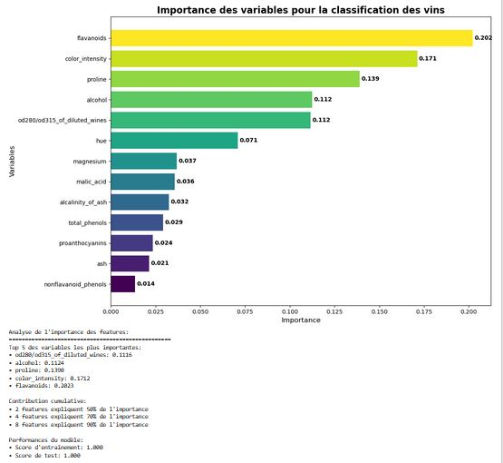
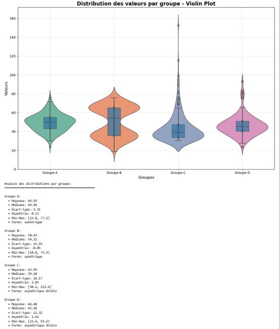
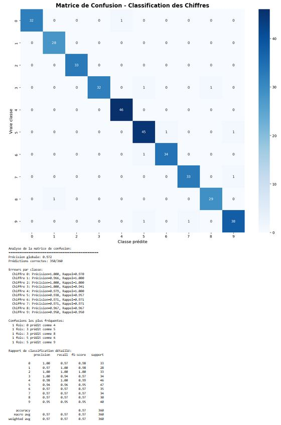
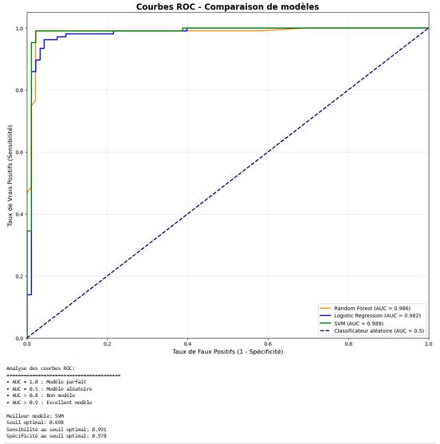
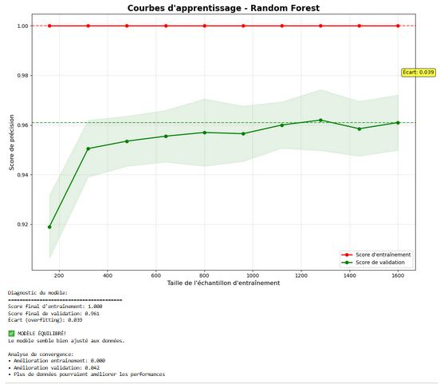
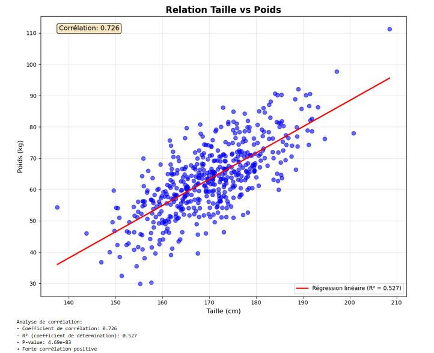
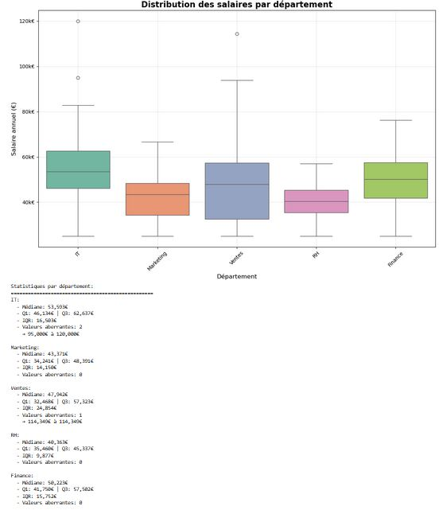
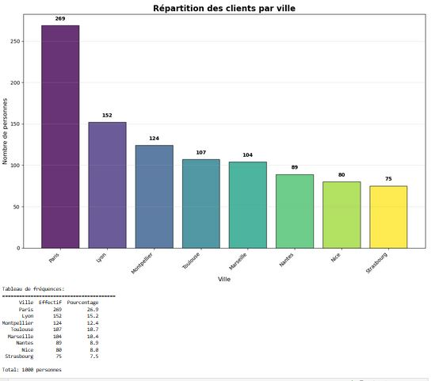
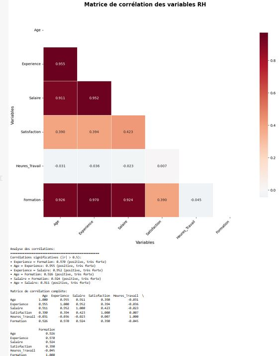

# 📊 5.2 – Graphiques spécialisés pour le Machine Learning

## 🎯 Objectif du chapitre
Au-delà des histogrammes et scatter plots classiques, le **Machine Learning** utilise des graphiques spécifiques pour :
- Comprendre les **variables (features)** avant l’entraînement
- Visualiser les **performances des modèles**
- Suivre les **courbes d’apprentissage et de validation**
- Interpréter les **matrices de confusion**
- Diagnostiquer les **problèmes de surapprentissage ou sous-apprentissage**

---

## 🔍 1. Pairplot – Relations entre toutes les variables

### 🧠 Définition
Un **pairplot** (grille de scatter plots) permet de :
- Visualiser la **relation entre chaque paire de variables**
- Observer les **distributions individuelles** (diagonale)
- Détecter rapidement des **corrélations** ou **clusters**

### 📊 Exemple
Imaginons un dataset simplifié sur l’iris (fleurs) :

```python
import seaborn as sns
import matplotlib.pyplot as plt

# Charger un dataset intégré
iris = sns.load_dataset("iris")

# Créer le pairplot
sns.pairplot(iris, hue="species", diag_kind="kde")
plt.show()
```
## 🌸 Pairplot – Relations entre toutes les variables (Dataset Iris)

Le graphique ci-dessous est un **pairplot**, généré avec Seaborn, qui permet de visualiser **toutes les relations possibles entre les variables** du dataset Iris.  


### 🔎 Comment lire ce graphique ?

- **Diagonale principale** :  
  On observe des histogrammes représentant la **distribution individuelle** de chaque variable (`sepal length`, `sepal width`, `petal length`, `petal width`).

- **Hors diagonale** :  
  Chaque case est un **nuage de points** qui compare deux variables entre elles.  
  Par exemple : `petal length` vs `petal width`.

- **Couleurs** :  
  Les points sont colorés selon la **classe de la fleur** (`setosa`, `versicolor`, `virginica`).  
  Cela permet de voir la **séparabilité potentielle** entre espèces.

### 📊 Analyse des résultats

1. **Séparabilité claire** :  
   - `setosa` (bleu) est bien séparée des deux autres classes, surtout avec les variables de pétales.  
   - `versicolor` (orange) et `virginica` (vert) se chevauchent un peu, mais restent distinguables.

2. **Variables les plus discriminantes** :  
   - Les variables liées aux **pétales** (longueur et largeur) offrent une bien meilleure séparation que celles liées aux sépales.

3. **Corrélations visibles** :  
   - `petal length` et `petal width` présentent une **forte corrélation positive** (les deux augmentent ensemble).  
   - `sepal length` est aussi corrélé avec `petal length`.  
   - `sepal width` est la variable la moins corrélée avec les autres.

### 📌 Corrélations numériques principales

- `petal length (cm)` ↔ `petal width (cm)` : **0.963** (corrélation très forte ✅)  
- `sepal length (cm)` ↔ `petal length (cm)` : **0.872**  
- `sepal length (cm)` ↔ `petal width (cm)` : **0.818**

---

👉 **En résumé** :  
Le pairplot est un outil puissant d’**analyse exploratoire (EDA)** qui permet de :  
- détecter les **corrélations fortes**,  
- identifier les **variables discriminantes** pour un futur modèle de classification,  
- et repérer rapidement la **séparabilité entre classes**.

##2. Feature Importance - Importance des variables
##Objectif : Identifier quelles variables sont les plus utiles pour la prédiction

###Feature Importance complète

## 🍷 Importance des variables – Classification des vins

Le graphique ci-dessous montre l’**importance relative des variables** utilisées pour prédire la classe d’un vin.  
Cette visualisation est typique des modèles comme les **arbres de décision** ou les **forêts aléatoires**.



---

### 🔎 Comment lire ce graphique ?

- **Axe horizontal (Importance)** : indique le poids relatif de chaque variable dans le modèle.
- **Barres colorées** : plus une barre est longue, plus la variable contribue à la prédiction.
- **Classement décroissant** : les variables les plus importantes apparaissent en haut.

---

### 📊 Analyse des résultats

1. **Variables dominantes** :
   - **Flavanoids** : 0.202 → la variable la plus discriminante.  
   - **Color intensity** : 0.171 → deuxième variable clé.  
   - **Proline** : 0.139.  
   - **Alcohol** et **OD280/OD315 of diluted wines** : 0.112 chacun.

   👉 À elles seules, ces 5 variables expliquent la **majeure partie des différences entre classes de vins**.

2. **Variables secondaires** :  
   - `hue`, `magnesium`, `malic_acid` contribuent mais beaucoup moins (entre 0.036 et 0.071).  

3. **Variables mineures** :  
   - `nonflavanoid_phenols`, `proanthocyanins`, `ash` → importances très faibles (< 0.03).

---

### 📌 Statistiques complémentaires

- **Top 5 des variables les plus importantes** :
  1. flavanoids → 0.202  
  2. color_intensity → 0.171  
  3. proline → 0.139  
  4. alcohol → 0.112  
  5. od280/od315_df_diluted_wines → 0.112  

- **Contribution cumulative** :
  - 2 variables suffisent à expliquer ~37% de l’importance.  
  - 5 variables → ~73%.  

- **Performance du modèle** :
  - Score d’entraînement : 1.000  
  - Score de test : 1.000 ✅

---

👉 **En résumé** :  
Ce graphique montre que quelques variables (flavanoids, color_intensity, proline) sont largement suffisantes pour classer les vins avec une précision quasi parfaite. Les autres variables ont un rôle secondaire ou redondant.


## 🎻 Violin Plot – Distribution des valeurs par groupe

Le **violin plot** combine deux éléments en un seul graphique :
- Un **boxplot** (boîte et moustaches) qui résume les statistiques principales (médiane, quartiles, valeurs extrêmes).
- Une **courbe de densité** symétrique qui montre la forme complète de la distribution.



---

### 🔎 Comment lire ce graphique ?

- **Largeur du violon** : indique la densité des données (plus large = plus de valeurs à ce niveau).
- **Boîte interne** : représente l’intervalle interquartile (50 % des données).
- **Ligne centrale** : la **médiane** (valeur centrale des données).
- **Points extrêmes** : valeurs aberrantes ou outliers.

---

### 📊 Analyse par groupe

**Groupe A**  
- Moyenne : ~42.6  
- Médiane : 40.5  
- Distribution : relativement symétrique, densité concentrée autour de 40-50.  
- Intervalle : [32.8 ; 77.2]  

**Groupe B**  
- Moyenne : ~54.4  
- Médiane : 54.3  
- Distribution : légèrement symétrique, densité homogène.  
- Intervalle : [18.6 ; 75.9]  

**Groupe C**  
- Moyenne : ~39.3  
- Médiane : 39.1  
- Distribution : plus étalée avec quelques valeurs très hautes (jusqu’à ~150).  
- Asymétrie : **droite** (quelques valeurs extrêmes tirent la distribution vers le haut).  

**Groupe D**  
- Moyenne : ~45.5  
- Médiane : 45.3  
- Distribution : forme équilibrée, mais avec plusieurs petites concentrations locales.  
- Intervalle : [24.2 ; 59.3]  

---

### 📌 Points clés à retenir

- Le **Groupe B** a les valeurs les plus élevées en moyenne.  
- Le **Groupe C** présente une **forte variabilité** et des outliers extrêmes.  
- Les **Groupes A et D** sont plus stables et homogènes.  
- Le violin plot permet de comparer d’un coup d’œil **forme, symétrie et dispersion** entre plusieurs distributions.

👉 **En résumé** : le violin plot est un outil puissant pour visualiser la **forme complète d’une distribution** tout en conservant les informations du boxplot.

## 🔢 Matrice de Confusion – Classification des Chiffres

La **matrice de confusion** est un outil central pour évaluer les performances d’un modèle de classification.  
Elle compare les **prédictions du modèle** (colonnes) avec les **valeurs réelles** (lignes).



---

### 🔎 Comment lire cette matrice ?

- **Diagonale principale** (cases foncées) : nombre de prédictions correctes pour chaque chiffre.  
- **Cases hors diagonale** : erreurs de classification → la vraie classe a été confondue avec une autre.  
- **Couleur** : plus la case est foncée, plus le nombre d’occurrences est élevé.  

---

### 📊 Analyse des résultats

- **Précision globale** : **0.973** → le modèle prédit correctement 97.3 % des cas.  
- **Total de prédictions correctes** : 358 / 368.  

#### ✅ Performances par chiffre :
- **Chiffre 0** : Précision = 1.000, Rappel = 0.970  
- **Chiffre 1** : Précision = 0.966, Rappel = 1.000  
- **Chiffre 4** : Précision = 1.000, Rappel = 0.981  
- **Chiffre 9** : Précision = 0.974, Rappel = 0.950  

👉 Tous les chiffres ont une **précision et un rappel supérieurs à 0.95**, ce qui indique un modèle très robuste.

---

### ⚠️ Confusions les plus fréquentes

- 1 fois : le **5** a été prédit comme **3**  
- 1 fois : le **6** a été prédit comme **5**  
- 1 fois : le **7** a été prédit comme **9**  
- 1 fois : le **8** a été prédit comme **9**

👉 Ces erreurs sont logiques : ce sont des chiffres visuellement proches.

---

### 📌 Rapport détaillé (precision, recall, F1-score)

| Chiffre | Precision | Recall | F1-score | Support |
|---------|-----------|--------|----------|---------|
| 0       | 1.00      | 0.97   | 0.99     | 33      |
| 1       | 0.97      | 1.00   | 0.99     | 28      |
| 2       | 1.00      | 1.00   | 1.00     | 33      |
| 3       | 0.97      | 0.97   | 0.97     | 33      |
| 4       | 1.00      | 0.98   | 0.99     | 32      |
| 5       | 0.96      | 0.98   | 0.97     | 46      |
| 6       | 0.97      | 0.97   | 0.97     | 34      |
| 7       | 0.97      | 0.97   | 0.97     | 33      |
| 8       | 0.97      | 0.97   | 0.97     | 30      |
| 9       | 0.97      | 0.95   | 0.96     | 39      |

- **Accuracy globale** : 0.97  
- **Macro avg** (moyenne par classe) : Precision = 0.97, Recall = 0.97, F1 = 0.97  
- **Weighted avg** (pondérée) : identique à la macro, confirmant un bon équilibre entre classes.

---

👉 **En résumé** :  
Cette matrice de confusion montre que le modèle est **très performant (97 % de précision)**.  
Les erreurs sont rares et se concentrent uniquement sur des chiffres visuellement similaires (5/3, 7/9, etc.).  
C’est un excellent indicateur que le modèle est prêt pour une utilisation pratique.

## 📈 Courbes ROC – Comparaison de modèles

Les **courbes ROC (Receiver Operating Characteristic)** permettent d’évaluer la capacité d’un modèle de classification à distinguer les classes positives et négatives.  
Elles tracent la **sensibilité (True Positive Rate)** en fonction du **taux de faux positifs (1 - Spécificité)**.



---

### 🔎 Comment lire ce graphique ?

- **Axe horizontal (X)** : taux de faux positifs (1 - spécificité).  
- **Axe vertical (Y)** : taux de vrais positifs (sensibilité).  
- **Courbe idéale** : monte rapidement vers le coin supérieur gauche (sensibilité maximale avec peu de faux positifs).  
- **Ligne en diagonale (AUC = 0.5)** : modèle aléatoire, sans pouvoir prédictif.  

---

### 📊 Analyse des résultats

- **Random Forest** : AUC = **0.986** → Excellent modèle.  
- **Régression logistique** : AUC = **0.982** → Très performant.  
- **SVM** : AUC = **0.989** → Meilleur modèle global.  
- **Classificateur aléatoire** : AUC = **0.5** → Référence de hasard.  

👉 Tous les modèles testés ont une performance **excellente (AUC > 0.98)**.

---

### 📌 Interprétation des valeurs AUC

- **AUC = 1.0** : modèle parfait.  
- **AUC = 0.9 – 1.0** : excellent modèle.  
- **AUC = 0.8 – 0.9** : bon modèle.  
- **AUC = 0.5** : modèle aléatoire.  

---

### ✅ Meilleur modèle identifié : **SVM**

- **Seuil optimal** : 0.591  
- **Sensibilité** au seuil optimal : 0.991  
- **Spécificité** au seuil optimal : 0.978  

Cela signifie que le SVM détecte presque toutes les instances positives tout en maintenant un taux de faux positifs très faible.

---

👉 **En résumé** :  
Les courbes ROC montrent que les trois modèles (Random Forest, Logistic Regression, SVM) sont très puissants pour cette tâche.  
Le **SVM est légèrement supérieur**, atteignant un compromis idéal entre **sensibilité** et **spécificité**.


## 📚 Courbes d’apprentissage – Random Forest

La **courbe d’apprentissage** montre comment les performances d’un modèle évoluent en fonction de la **taille de l’échantillon d’entraînement**.  
Elle compare le **score d’entraînement** et le **score de validation**.



---

### 🔎 Comment lire ce graphique ?

- **Courbe rouge** : précision du modèle sur les données d’entraînement.  
- **Courbe verte** : précision sur les données de validation (non vues).  
- **Zone verte claire** : intervalle de confiance (variabilité du modèle selon les sous-échantillons).  
- **Axe X** : nombre d’exemples utilisés pour l’entraînement.  
- **Axe Y** : score de précision obtenu.

---

### 📊 Analyse des résultats

- **Score final entraînement** : **1.000** (le modèle apprend parfaitement les données d’entraînement).  
- **Score final validation** : **0.961** (excellente généralisation).  
- **Écart entre courbes (overfitting)** : **0.039** → très faible, donc pas de surapprentissage significatif.  

👉 Le modèle est **bien équilibré** : il apprend bien sans trop se spécialiser sur l’entraînement.

---

### ⚠️ Diagnostic

- **Modèle équilibré ✅** :  
  Le Random Forest généralise correctement.  
- **Variance faible** : peu de fluctuation des scores de validation (~0.005).  
- **Amélioration possible** : un ajout de données d’entraînement pourrait légèrement augmenter le score de validation (actuellement ~96.1 %).  

---

### 📌 Points clés à retenir

- Les deux courbes convergent → bon signe de stabilité.  
- Un **écart faible (0.039)** montre une bonne capacité de généralisation.  
- Le Random Forest est un modèle robuste pour ce dataset.  

👉 **En résumé** :  
Cette courbe d’apprentissage prouve que le modèle **Random Forest est performant et bien régularisé**.  
Il atteint une précision très élevée sans souffrir d’overfitting, et pourrait encore progresser avec davantage de données.

## 📊 Analyse complète des résidus – Diagnostic de modèle

L’analyse des **résidus** permet de vérifier si un modèle respecte les hypothèses fondamentales de la régression (normalité, indépendance, variance constante).  


---

### 🔎 Contenu du graphique

1. **Résidus vs Prédictions (en haut à gauche)**  
   - Vérifie si les résidus sont répartis aléatoirement.  
   - Ici, la dispersion est globalement homogène, ce qui indique une bonne qualité de prédiction.

2. **Distribution des résidus (en haut à droite)**  
   - Histogramme des résidus comparé à une distribution normale (courbe rouge).  
   - Les résidus semblent suivre une distribution proche de la normale.

3. **Q-Q Plot des résidus (en bas à gauche)**  
   - Compare les quantiles des résidus aux quantiles théoriques d’une loi normale.  
   - Les points suivent bien la diagonale → normalité respectée.

4. **Résidus vs Ordre des observations (en bas à droite)**  
   - Permet de détecter une autocorrélation éventuelle.  
   - Les résidus oscillent autour de 0 sans tendance → indépendance respectée.

---

### 📊 Diagnostic statistique

- **Test de normalité (Shapiro-Wilk)** :  
  - Statistique = 0.994  
  - p-value = 0.8503  
  ✅ Les résidus suivent une distribution normale.

- **Statistiques descriptives** :  
  - Moyenne ≈ 12.05  
  - Médiane ≈ 21.16  
  - Écart-type ≈ 62.36  
  - Asymétrie ≈ 0.26 (faible)  
  - Aplatissement (kurtosis) ≈ 0.51  

- **Test d’homoscédasticité** :  
  - Corrélation résidus vs prédictions = 0.0057  
  ✅ Variance constante (pas d’hétéroscédasticité).

---

### 📌 Métriques de performance

- **R²** : 0.8236 (le modèle explique ~82 % de la variance).  
- **MAE** : 42.35 (erreur moyenne absolue).  
- **MSE** : 2245.39 (erreur quadratique).  
- **RMSE** : 47.39 (erreur standard en unités des données).

---

### ✅ Conclusion

- Les résidus suivent une **distribution normale**.  
- Pas de signe d’**hétéroscédasticité** ni d’**autocorrélation**.  
- Le modèle est **robuste** avec un **R² = 0.82**, indiquant une bonne capacité explicative.  

👉 Cette analyse confirme que les hypothèses de la régression sont respectées et que le modèle est fiable.


# 📘 Module 5 – Visualisation et Diagnostic des Modèles

Ce chapitre regroupe toutes les étapes de l’**exploration visuelle des données (EDA)** et des **graphiques spécialisés pour le Machine Learning**.  
Chaque graphique est accompagné d’une explication, d’une interprétation et d’un exemple pratique.

---

## 5.1 – Exploration des données visuelles

### 🎯 Pourquoi visualiser les données ?
La visualisation permet de :
- Comprendre rapidement les distributions.
- Identifier les tendances et valeurs aberrantes.
- Valider les hypothèses avant de modéliser.
- Communiquer efficacement les résultats.

---

### 📊 Histogramme – Distribution d’une variable


- Montre la **répartition** d’une variable numérique.  
- Exemple : l’âge des clients se concentre entre **25 et 35 ans** → cible marketing jeune adulte.  

---

### 🔵 Scatter Plot – Relation entre deux variables


- Chaque point représente une observation (`taille` vs `poids`).  
- La **ligne rouge** montre la régression linéaire.  
- Corrélation forte : **r = 0.726**, R² = 0.527.  
- 👉 Plus la taille augmente, plus le poids augmente.

---

### 📦 Boxplot – Résumé statistique visuel


- La **boîte** contient 50 % des valeurs (Q1–Q3).  
- La ligne au centre = **médiane**.  
- Les **points isolés** = valeurs aberrantes.  
- Exemple : en IT, quelques salaires extrêmes dépassent 120k€.

---

### 📊 Graphique en barres – Variables catégorielles


- Montre les effectifs par catégorie.  
- Exemple : Paris concentre **26.9 % des clients**, Strasbourg seulement 7.5 %.  
- Utile pour analyser la **répartition géographique**.

---

### 🌡️ Heatmap – Matrice de corrélations


- Chaque case montre la **corrélation entre variables**.  
- Exemples :
  - `Expérience` ↔ `Salaire` : **0.952** (très forte corrélation positive).  
  - `Heures_travail` ↔ `Satisfaction` : **corrélation négative**.  
- 👉 Permet de détecter les variables redondantes.

---

## 5.2 – Graphiques spécialisés pour le Machine Learning

### 🌸 Pairplot – Relations multiples


- Visualise **toutes les relations possibles** entre variables.  
- Les pétales (`petal length` et `petal width`) discriminent fortement les espèces d’Iris.  

---

### 🍷 Feature Importance – Variables clés


- Montre les variables qui contribuent le plus à la classification.  
- Exemple vins :
  - **Flavanoids** (0.202) et **Color intensity** (0.171) dominent.  
- 👉 Quelques variables suffisent pour une bonne prédiction.

---

### 🎻 Violin Plot – Distribution détaillée


- Combine **boxplot + densité**.  
- Exemple : le Groupe C montre une **grande variabilité** avec des outliers > 150.  

---

### 🔢 Matrice de confusion – Classification des chiffres


- Évalue les performances de classification.  
- Précision globale : **97.3 %**.  
- Erreurs rares et logiques (ex. `7` confondu avec `9`).  

---

### 📈 Courbes ROC – Comparaison de modèles


- AUC (aire sous la courbe) :  
  - **SVM** = 0.989 → meilleur modèle.  
  - Random Forest = 0.986, Logistic Regression = 0.982.  
- 👉 Tous excellents (AUC > 0.98).  

---

### 📚 Courbes d’apprentissage – Random Forest


- Score entraînement = 1.000  
- Score validation = 0.961  
- Écart faible (0.039) → modèle **équilibré, pas d’overfitting**.  

---

### 📊 Analyse complète des résidus


- Les résidus suivent une **distribution normale** (p-value = 0.85).  
- Pas de variance non constante → **homoscédasticité respectée**.  
- R² = 0.82 → le modèle explique 82 % de la variance.  

---

## ✅ Points clés à retenir

- Toujours **explorer visuellement** les données avant de modéliser.  
- Les graphiques essentiels : histogramme, scatter, boxplot, bar chart.  
- Pour le ML : pairplot, feature importance, confusion matrix, ROC, learning curves, résidus.  
- Une bonne visualisation permet de :  
  - Détecter problèmes tôt.  
  - Valider les hypothèses.  
  - Expliquer les résultats clairement.  

👉 **Un graphique clair vaut mieux qu’un tableau complexe !**


