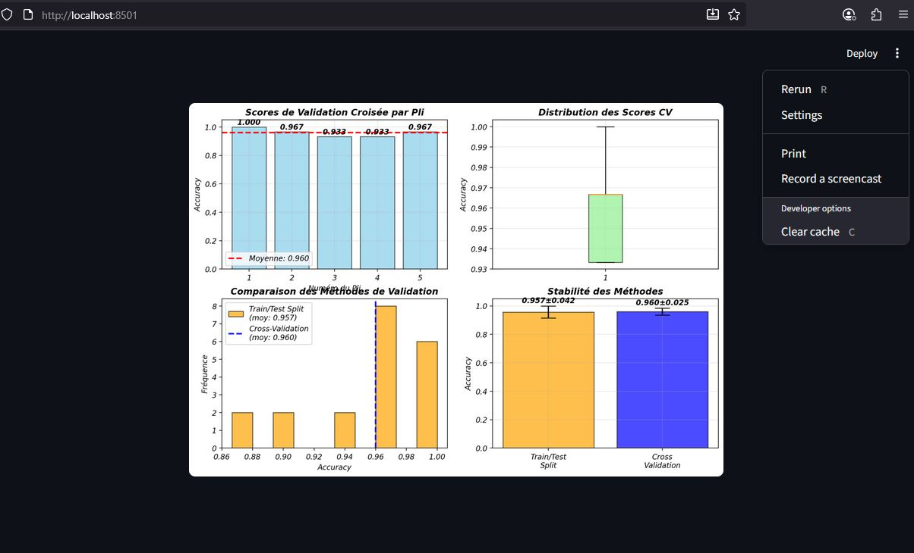

# 📘 Module 6 • Chapitre 1 – Validation croisée simple
**Niveau : Débutant • Durée : ~30–35 min**  
👉 La validation, votre assurance qualité : apprendre à évaluer correctement vos modèles ML pour éviter les mauvaises surprises en production.

---

## 🎯 Objectifs d’apprentissage
À la fin de ce chapitre, vous saurez :
- Pourquoi la validation est cruciale en Machine Learning  
- Le problème du simple **train/test split**  
- Le principe de la **validation croisée**  
- Les différents types de validation croisée  
- Comment l’implémenter en Python  
- Comment interpréter correctement les résultats  

---

## ❓ Le problème fondamental
**Comment savoir si votre modèle est vraiment bon ?**

### Exemple imagé
- Vous révisez un examen en étudiant seulement les questions de l’année passée.  
- Le jour J, les questions changent → ❌ échec.  
- Vous n’aviez pas appris à généraliser, seulement à mémoriser.  

👉 En ML, c’est le problème de **l’overfitting**.  
Un modèle peut être excellent sur ses données d’entraînement, mais catastrophique en production.

### Histoire vraie
- Une entreprise entraînait un modèle de prédiction des ventes.  
- **98% de précision** sur les données historiques → succès apparent.  
- En production, **70% d’erreurs** → le modèle avait mémorisé au lieu d’apprendre.  

---

## 👨‍🏫 Analogie du professeur et de l’élève

| Mauvaise méthode | Bonne méthode |
|------------------|---------------|
| Donner **exactement les mêmes exercices** vus en cours | Donner des **exercices similaires mais nouveaux** |
| L’élève réussit → impression de maîtrise | L’élève doit **appliquer ce qu’il a appris** |
| Mais en réalité, il a juste **mémorisé** | S’il réussit → il a vraiment compris |
| Échec dès qu’on change les questions | Évaluation honnête de sa capacité |

👉 Moralité : **il faut tester sur des données nouvelles pour évaluer correctement.**

---

## 📉 Le train/test split classique et ses limites

### Principe
- On divise les données : **80% train / 20% test**.  
- Simple, rapide et efficace… en théorie.  

### Problème
- Si par hasard le **test set** est trop facile ou trop difficile → résultat biaisé.  

### Analogie du sondage
- C’est comme interroger uniquement les habitants d’un quartier.  
- Votre estimation sera fausse pour tout le pays.  

---

## 📧 Exemple concret
- Modèle de détection de spam avec 1000 emails.  
  - 800 pour l’entraînement  
  - 200 pour le test  
- Si les 200 emails de test contiennent beaucoup de spams trop évidents → le modèle semblera parfait.  
- Mais face à des spams plus subtils, il échouera.  

👉 **Une seule mesure peut mentir. Plusieurs mesures révèlent la vérité.**

---

## 🔄 La validation croisée : la solution intelligente

### Principe
- Diviser les données en plusieurs paquets (*folds*).  
- Tour à tour : entraîner sur K-1 folds et tester sur le fold restant.  
- Répéter K fois → moyenne des résultats.  

### Analogie
- Faire passer plusieurs examens différents à un élève.  
- S’il réussit à chaque fois → il a vraiment compris.  
- S’il réussit une seule fois → c’était peut-être de la chance.

---

## 🔟 Exemple : Validation croisée à 5 plis (5-fold CV)

1. Diviser les données en 5 paquets égaux  
2. **Test 1** : train sur 4 paquets, test sur le 5ᵉ  
3. **Test 2** : train sur 4 paquets différents, test sur 1 autre  
4. Répéter 5 fois  
5. **Résultat final** : moyenne des 5 scores  

👉 Avantage :  
Chaque donnée sert **à la fois pour le train et pour le test**, mais jamais en même temps.  
On utilise **100% des données** de manière honnête.  

---

## 📏 Choix du nombre de plis (K)

| Nombre de plis | Avantage | Inconvénient |
|----------------|----------|--------------|
| **3 plis** | Rapide, peu coûteux | Peu précis, forte variance |
| **5–10 plis** | ✅ Bon compromis, fiable | Temps de calcul raisonnable |
| **20+ plis** | Très précis | Calcul coûteux, variabilité plus élevée |

👉 Standard de l’industrie : **5 ou 10 plis**.

---

## 🧰 Types de validation croisée

1. **K-Fold Cross-Validation**  
   - La méthode classique (décrite ci-dessus).  
   - Diviser en K blocs → entraîner K fois.  

2. *(À venir dans la suite du module : stratifiée, leave-one-out, etc.)*

---

## 💻 Exemple en Python
```python
from sklearn.model_selection import cross_val_score
from sklearn.datasets import load_iris
from sklearn.linear_model import LogisticRegression

# Charger un dataset
X, y = load_iris(return_X_y=True)

# Modèle simple
model = LogisticRegression(max_iter=200)

# Validation croisée à 5 plis
scores = cross_val_score(model, X, y, cv=5)

print("Scores par pli :", scores)
print("Score moyen :", scores.mean())
```


# 📊 Validation Croisée K-Fold – Explication du Graphique

## 📝 Contexte
La **validation croisée (K-Fold Cross-Validation)** est une méthode d’évaluation robuste des modèles de Machine Learning.  
Elle consiste à diviser le dataset en *K sous-échantillons (ou plis)*, à entraîner le modèle sur *K-1* plis, puis à tester sur le pli restant.  
L’opération est répétée *K fois* et la performance moyenne est calculée.

Dans ce graphique, nous analysons la stabilité et la performance d’un modèle avec une validation croisée **K=5**.

---

## 🔹 Partie 1 – Scores par pli (en haut à gauche)
- Chaque barre représente le **score d’accuracy obtenu pour un pli spécifique**.  
- On observe des scores compris entre **0.933 et 1.000**, avec une moyenne de **0.960** (indiquée par la ligne rouge).  
- Conclusion : le modèle est **globalement stable**, bien qu’un pli ait donné un score légèrement plus bas (0.933).

---

## 🔹 Partie 2 – Distribution des scores CV (en haut à droite)
- Le **boxplot** illustre la variabilité des scores obtenus sur les différents plis.  
- La boîte verte montre la **dispersion des valeurs**, et les moustaches indiquent les bornes extrêmes.  
- Ici, la variance est faible → le modèle est **cohérent et fiable**.

---

## 🔹 Partie 3 – Comparaison Train/Test vs Cross-Validation (en bas à gauche)
- Histogramme comparant les scores obtenus en **split simple (Train/Test)** et en **validation croisée (CV)**.  
- Moyenne Train/Test : **0.957**  
- Moyenne CV : **0.960**  
- Les deux méthodes donnent des résultats proches, confirmant la **bonne généralisat**


#2. Stratified K-Fold : Quand vos classes sont déséquilibrées
Le problème : Imaginez que vous avez un dataset de diagnostic médical avec 95% de patients sains et 5% de patients malades. Si vous faites une validation croisée normale, vous risquez d'avoir un pli avec AUCUN patient malade ! Votre modèle n'apprendra jamais à les détecter.

La solution Stratified : Cette méthode intelligente s'assure que chaque pli contient la même proportion de chaque classe. C'est comme s'assurer que chaque équipe de foot a le même nombre d'attaquants, de défenseurs et de gardiens !


