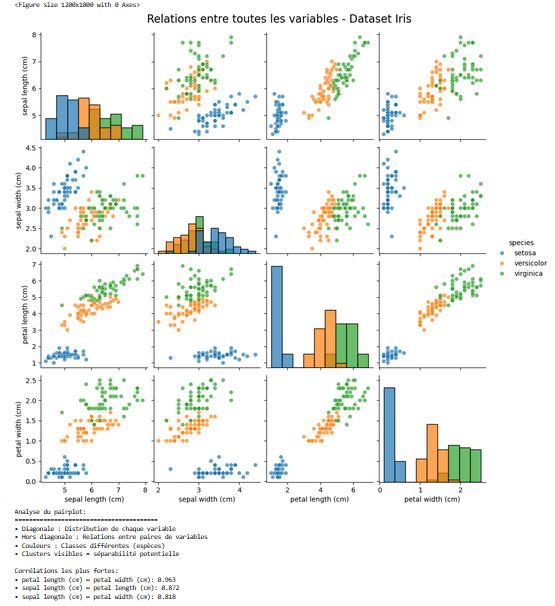

# 📊 5.2 – Graphiques spécialisés pour le Machine Learning

## 🎯 Objectif du chapitre
Au-delà des histogrammes et scatter plots classiques, le **Machine Learning** utilise des graphiques spécifiques pour :
- Comprendre les **variables (features)** avant l’entraînement
- Visualiser les **performances des modèles**
- Suivre les **courbes d’apprentissage et de validation**
- Interpréter les **matrices de confusion**
- Diagnostiquer les **problèmes de surapprentissage ou sous-apprentissage**

---

## 🔍 1. Pairplot – Relations entre toutes les variables

### 🧠 Définition
Un **pairplot** (grille de scatter plots) permet de :
- Visualiser la **relation entre chaque paire de variables**
- Observer les **distributions individuelles** (diagonale)
- Détecter rapidement des **corrélations** ou **clusters**

### 📊 Exemple
Imaginons un dataset simplifié sur l’iris (fleurs) :

```python
import seaborn as sns
import matplotlib.pyplot as plt

# Charger un dataset intégré
iris = sns.load_dataset("iris")

# Créer le pairplot
sns.pairplot(iris, hue="species", diag_kind="kde")
plt.show()
```
## 🌸 Pairplot – Relations entre toutes les variables (Dataset Iris)

Le graphique ci-dessous est un **pairplot**, généré avec Seaborn, qui permet de visualiser **toutes les relations possibles entre les variables** du dataset Iris.  



### 🔎 Comment lire ce graphique ?

- **Diagonale principale** :  
  On observe des histogrammes représentant la **distribution individuelle** de chaque variable (`sepal length`, `sepal width`, `petal length`, `petal width`).

- **Hors diagonale** :  
  Chaque case est un **nuage de points** qui compare deux variables entre elles.  
  Par exemple : `petal length` vs `petal width`.

- **Couleurs** :  
  Les points sont colorés selon la **classe de la fleur** (`setosa`, `versicolor`, `virginica`).  
  Cela permet de voir la **séparabilité potentielle** entre espèces.

### 📊 Analyse des résultats

1. **Séparabilité claire** :  
   - `setosa` (bleu) est bien séparée des deux autres classes, surtout avec les variables de pétales.  
   - `versicolor` (orange) et `virginica` (vert) se chevauchent un peu, mais restent distinguables.

2. **Variables les plus discriminantes** :  
   - Les variables liées aux **pétales** (longueur et largeur) offrent une bien meilleure séparation que celles liées aux sépales.

3. **Corrélations visibles** :  
   - `petal length` et `petal width` présentent une **forte corrélation positive** (les deux augmentent ensemble).  
   - `sepal length` est aussi corrélé avec `petal length`.  
   - `sepal width` est la variable la moins corrélée avec les autres.

### 📌 Corrélations numériques principales

- `petal length (cm)` ↔ `petal width (cm)` : **0.963** (corrélation très forte ✅)  
- `sepal length (cm)` ↔ `petal length (cm)` : **0.872**  
- `sepal length (cm)` ↔ `petal width (cm)` : **0.818**

---

👉 **En résumé** :  
Le pairplot est un outil puissant d’**analyse exploratoire (EDA)** qui permet de :  
- détecter les **corrélations fortes**,  
- identifier les **variables discriminantes** pour un futur modèle de classification,  
- et repérer rapidement la **séparabilité entre classes**.

