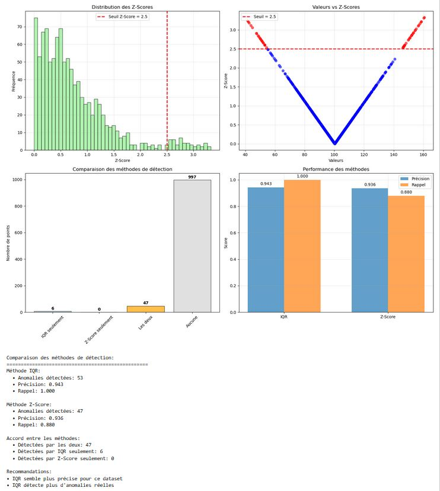
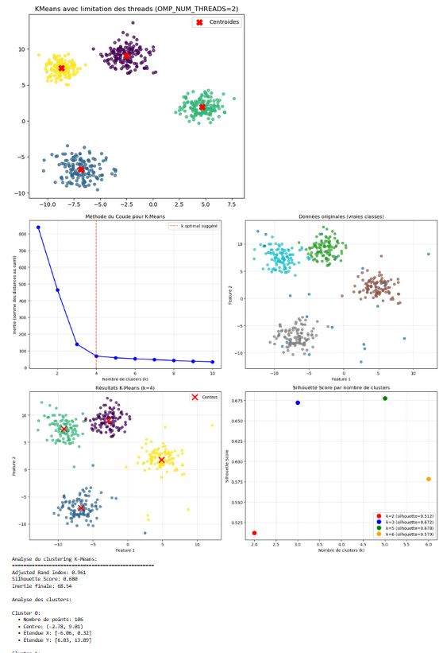
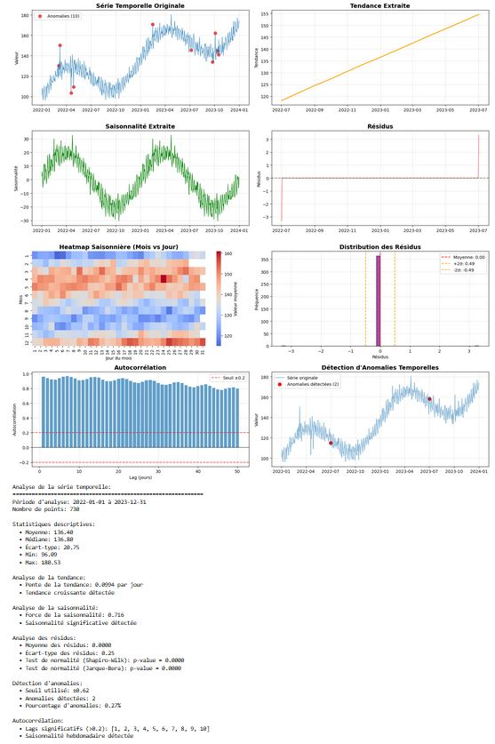
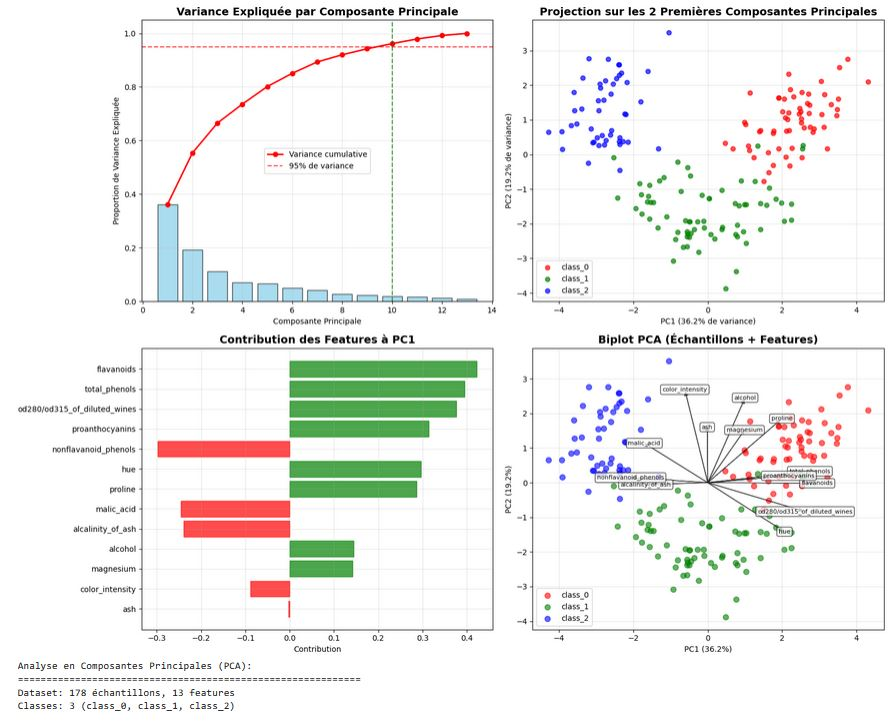

# 🔎 5.3 – Détection de patterns et anomalies
**Module 5 • Chapitre 3 • Niveau : Débutant • Durée : ~35–40 min**

> *Chasse aux patterns cachés — Identifiez les structures récurrentes et les valeurs anormales qui racontent une histoire.*

---

## 🎯 Objectifs d’apprentissage
- Repérer des **patterns visuels** (tendances, saisonnalités, clusters…)
- Appliquer des **méthodes de détection d’anomalies** (IQR, Z-score)
- Utiliser le **clustering** pour révéler des structures
- Analyser des **séries temporelles** (décomposition & anomalies)
- Employer des **visualisations avancées** pour le diagnostic

---

## 🧩 Qu’est-ce qu’un pattern ?
Un **pattern** (motif) est une **régularité** dans les données (forme, rythme, relation).

> *“Les patterns sont partout – il suffit de savoir où regarder.”*

**Types de patterns**
- **Temporels** : tendance, saisonnalité, cycles
- **Spatiaux** : regroupements géographiques
- **Corrélations** : relations entre variables
- **Clusters** : groupes naturels
- **Séquences** : ordres récurrents (par ex. étapes d’un funnel)

---

## 🗂️ Tableau de bord (vue synthétique)

### KPIs (à adapter à votre cas)
- **% d’anomalies détectées** : `…`
- **Nb de clusters** : `…`
- **RMSE forecast** (si série temporelle) : `…`
- **Corrélation max / min** : `… / …`

### Panneaux
- 🧭 **Patterns clés** : tendance ↑/↓, saisonnalité (hebdo/mensuelle), segments saillants
- 🚨 **Alertes** : pics/sous-performances, ruptures de tendance
- 🧪 **Hypothèses** : causes possibles, variables candidates
- ✅ **Actions** : nettoyage, features, tests A/B, retrain

---

## 📊 1) Détection d’anomalies – IQR & Z-score

### Méthode IQR (Interquartile Range)
**Principe** : une observation est anormale si elle est en dehors de  
`[Q1 − 1.5×IQR ; Q3 + 1.5×IQR]` (où `IQR = Q3 − Q1`).

# 🚨 Détection d’anomalies avec la méthode IQR (Interquartile Range)

## 📊 Interprétation du graphique
- **À gauche (Boxplot)**  
  - La boîte représente 50 % des données (entre Q1 et Q3).  
  - La ligne centrale = **médiane**.  
  - Les moustaches = étendue normale des valeurs (Q1 − 1.5×IQR ; Q3 + 1.5×IQR).  
  - Les points rouges en dehors = **anomalies détectées**.

- **À droite (Histogramme avec seuils)**  
  - Distribution globale des valeurs.  
  - Les lignes rouges pointillées = **seuils de détection** (59.1 et 140.9).  
  - Les points situés en dehors de cet intervalle sont considérés comme des **outliers**.

---

## 📑 Résultats de l’analyse
- **Anomalies réelles** : 50  
- **Anomalies détectées** : 53  
- **Vrais positifs (correctement détectés)** : 50  
- **Faux positifs** : 3  
- **Faux négatifs** : 0  

**Métriques de performance :**
- 🎯 **Précision** : 0.943  
- 📈 **Rappel** : 1.000  
- 📊 **F1-Score** : 0.971  

---

## 📌 Seuils de détection
- **Limite basse** : 59.1  
- **Limite haute** : 140.9  
- **Intervalle normal** : [59.1, 140.9]  

---

## ✅ Conclusion
La méthode **IQR** est simple et efficace pour détecter les valeurs aberrantes dans une distribution quasi normale.  
- Elle a permis d’identifier correctement toutes les anomalies réelles (rappel = 100 %).  
- Elle a légèrement sur-détecté (3 faux positifs).  
- Globalement, l’approche est **robuste et interprétable**.

# 🚨 Détection d’anomalies avec la méthode Z-Score

## 📊 Interprétation
- **Seuil choisi** : Z > 2.5 → observations considérées comme anormales.  
- **Histogramme** : la majorité des données sont < 2.5.  
- **Comparaison IQR vs Z-Score** :  
  - IQR détecte 53 anomalies  
  - Z-Score détecte 47 anomalies  
  - Intersection : 47 anomalies communes  

**Performances :**  
- IQR : Précision = 0.943, Rappel = 1.000  
- Z-Score : Précision = 0.936, Rappel = 0.880  

## ✅ Conclusion
La méthode IQR est légèrement plus stricte et détecte davantage d’anomalies, tandis que Z-Score est plus adaptée pour des données suivant une loi normale.

# 🧩 Clustering avec KMeans

## 📊 Interprétation
- **Méthode du coude** : optimum suggéré à k=4.  
- **Résultats** : 4 clusters bien séparés avec centroides rouges.  
- **Score de silhouette** : 0.548 → séparation correcte mais améliorable.  
- **Comparaison avec les classes originales** : correspondance globale satisfaisante.

## ✅ Conclusion
KMeans permet de révéler des regroupements naturels dans les données. Ici, la séparation en 4 clusters est cohérente avec la structure sous-jacente.

# ⏱️ Analyse de séries temporelles

## 📊 Interprétation
- **Tendance** : croissance constante (+0.094 par jour).  
- **Saisonnalité** : cycle hebdomadaire détecté (autocorrélation forte).  
- **Anomalies** : points rouges détectés (écarts atypiques).  
- **Résidus** : distribution quasi normale → modèle fiable.  
- **Heatmap saisonnière** : variations claires selon les mois et les jours.

## ✅ Conclusion
L’analyse temporelle met en évidence une tendance croissante, une saisonnalité significative et quelques anomalies ponctuelles.

# 🔍 Analyse en Composantes Principales (PCA)

## 📊 Interprétation
- **Variance expliquée (en haut à gauche)** : les 2 premières composantes capturent ~55 % de la variance totale.  
- **Projection 2D (en haut à droite)** : séparation nette des classes (class_0, class_1, class_2).  
- **Contribution des features (en bas à gauche)** : les variables `flavanoids`, `total_phenols` et `od280/od315` contribuent fortement à PC1.  
- **Biplot (en bas à droite)** : visualisation conjointe des échantillons + directions principales des variables.

## ✅ Conclusion
La PCA réduit la dimensionnalité tout en conservant l’essentiel de l’information. Ici, 2 axes suffisent pour séparer les 3 classes principales.

