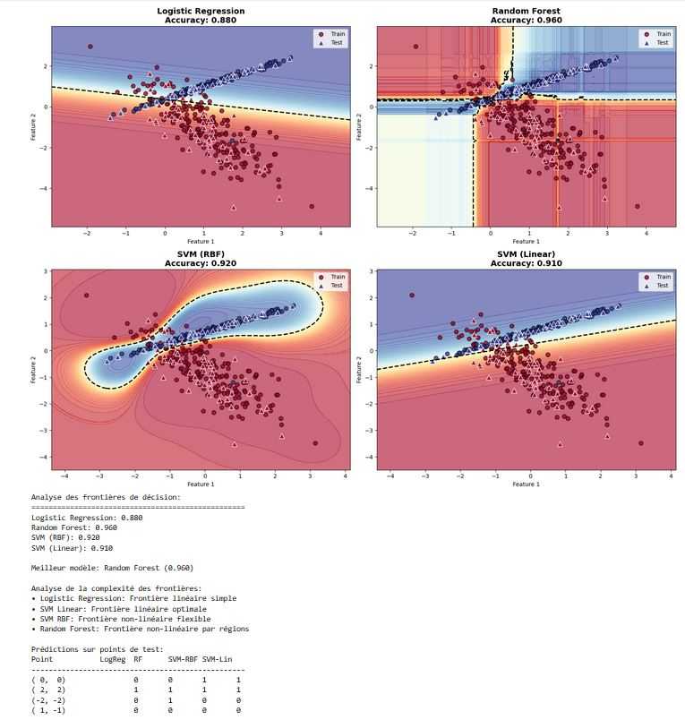
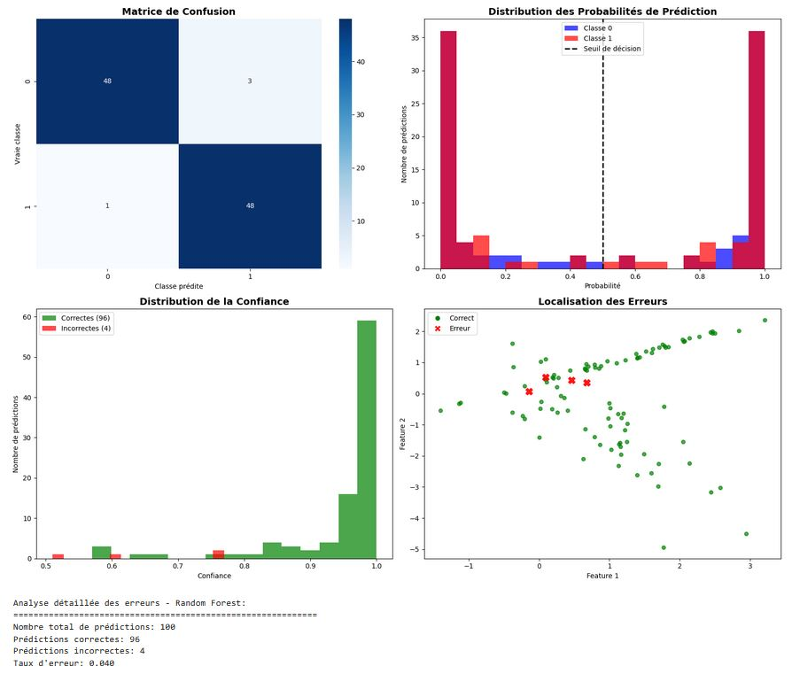
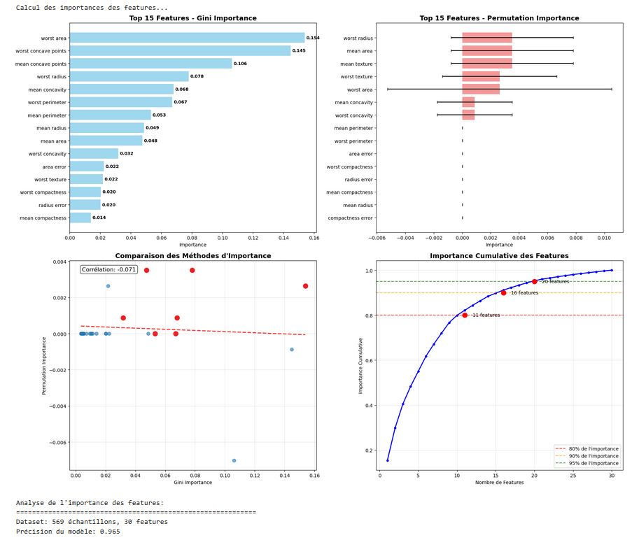
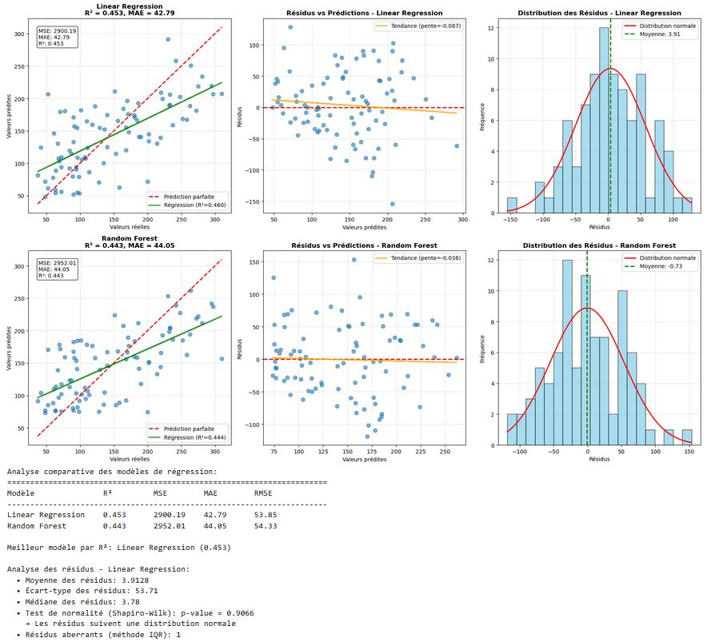

# 📘 Module 5 – Chapitre 4 : Visualisation des résultats de modèles

## 🎯 Objectif
Au-delà des métriques classiques (précision, rappel, F1-score), la **visualisation** permet de comprendre *comment* un modèle prend ses décisions, où il réussit et où il échoue.

---

## 📚 Ce que vous allez apprendre
- Visualiser les **frontières de décision**
- Analyser les **prédictions vs réalité**
- Comprendre l’**importance des features**
- Diagnostiquer les **erreurs de modèles**
- Créer des **rapports visuels complets**

---

## ❓ Pourquoi visualiser ?
Les métriques numériques **ne racontent qu'une partie de l'histoire**.

> Exemple : un modèle avec 95 % de précision peut encore cacher des biais importants ou des erreurs systématiques.

---

## ✅ Avantages de la visualisation
- 🔍 **Identifier** les patterns d'erreurs  
- ⚖️ **Comprendre** les biais du modèle  
- 🧪 **Valider** les hypothèses initiales  
- 📊 **Communiquer** les résultats efficacement  
- 🤝 **Améliorer la confiance** envers le modèle  

---

## 🔎 Ce qu’on peut découvrir
- Classes **mal séparées**
- **Overfitting** localisé dans certaines zones
- Features **non pertinentes**
- Données **aberrantes** influentes
- Régions d’**incertitude**

---

## 🛠️ Types de visualisations utiles
1. **Frontières de décision** : montrer comment un modèle sépare les classes dans un espace 2D.  
2. **Courbes Prédictions vs Réalité** : scatter plots, résidus, diagonale idéale.  
3. **Importance des features** : bar charts, SHAP values, permutation importance.  
4. **Matrice de confusion** : erreurs par classe.  
5. **Courbes ROC et PR** : comparer plusieurs modèles.  

---

## ✅ Conclusion
La visualisation complète les métriques numériques.  
Elle révèle :
- des **forces** : classes bien discriminées, variables pertinentes  
- des **faiblesses** : erreurs systématiques, biais, overfitting  

👉 En combinant **chiffres + graphiques**, on obtient une vision plus juste et plus exploitable des performances d’un modèle.

## 1. Frontières de décision en 2D
Objectif : Comprendre comment le modèle sépare les classes dans l'espace des features

Analyse des frontières de décision:
==================================================
Logistic Regression: 0.880
Random Forest: 0.960
SVM (RBF): 0.920
SVM (Linear): 0.910

Meilleur modèle: Random Forest (0.960)

Analyse de la complexité des frontières:
• Logistic Regression: Frontière linéaire simple
• SVM Linear: Frontière linéaire optimale
• SVM RBF: Frontière non-linéaire flexible
• Random Forest: Frontière non-linéaire par régions

Prédictions sur points de test:
Point		LogReg	RF	SVM-RBF	SVM-Lin
--------------------------------------------------
( 0,  0)		0	0	1	1
( 2,  2)		1	1	1	1
(-2, -2)		0	1	0	0
( 1, -1)		0	0	0	0

Analyse de confiance sur les points de test:

Point (0, 0):
  LogReg: Classe 0 (conf: 0.699)
  RF: Classe 0 (conf: 0.930)
  SVM-RBF: Classe 0 (conf: 0.512)

Point (2, 2):
  LogReg: Classe 1 (conf: 0.991)
  RF: Classe 1 (conf: 0.980)
  SVM-RBF: Classe 1 (conf: 0.936)

Point (-2, -2):
  LogReg: Classe 0 (conf: 0.998)
  RF: Classe 1 (conf: 0.560)
  SVM-RBF: Classe 0 (conf: 0.774)

Point (1, -1):
  LogReg: Classe 0 (conf: 0.934)
  RF: Classe 0 (conf: 0.990)
  SVM-RBF: Classe 0 (conf: 1.000)
  
### 🔎 Analyse des modèles
- **Logistic Regression (Acc = 0.88)** : frontière linéaire simple.  
- **Random Forest (Acc = 0.96)** : frontière complexe, adaptée aux données non-linéaires.  
- **SVM (RBF) (Acc = 0.92)** : frontière non-linéaire souple.  
- **SVM (Lin) (Acc = 0.91)** : frontière linéaire, moins flexible.  

### 📈 Conclusion
- Le **Random Forest** est le meilleur modèle avec **96% de précision**.  
- La complexité de la frontière reflète la capacité d’adaptation du modèle aux structures cachées des données.

## ❌ 2. Analyse des erreurs de classification – Random Forest
Objectif : Identifier où et pourquoi le modèle se trompe

Analyse détaillée des erreurs - Random Forest:
============================================================
Nombre total de prédictions: 100
Prédictions correctes: 96
Prédictions incorrectes: 4
Taux d'erreur: 0.040

Analyse par classe:

Classe 0:
  • Échantillons: 51
  • Correctes: 48
  • Taux de réussite: 0.941
  • Confiance moyenne: 0.938
  • Confiance min: 0.510
  • Confiance max: 1.000

Classe 1:
  • Échantillons: 49
  • Correctes: 48
  • Taux de réussite: 0.980
  • Confiance moyenne: 0.932
  • Confiance min: 0.590
  • Confiance max: 1.000

Analyse des prédictions incertaines:
Prédictions avec confiance < 0.6: 4
Précision sur prédictions incertaines: 0.750
Exemples de prédictions incertaines:
  • Réel: 1, Prédit: 1, Confiance: 0.590
  • Réel: 1, Prédit: 1, Confiance: 0.590
  • Réel: 0, Prédit: 1, Confiance: 0.510
  • Réel: 0, Prédit: 0, Confiance: 0.570

Analyse spatiale des erreurs:
Centroïde des erreurs: (0.27, 0.35)
Dispersion des erreurs - Feature 1: 0.319, Feature 2: 0.173

Rapport de classification détaillé:
              precision    recall  f1-score   support
    Classe 0       0.98      0.94      0.96        51
    Classe 1       0.94      0.98      0.96        49
    accuracy                           0.96       100
   macro avg       0.96      0.96      0.96       100
weighted avg       0.96      0.96      0.96       100

Recommandations pour améliorer le modèle:

### 🔎 Résultats
- **Nombre total de prédictions** : 100  
- **Prédictions correctes** : 96  
- **Prédictions incorrectes** : 4  
- **Taux d’erreur** : 4%  

### 📊 Visualisations
- **Matrice de confusion** : quelques confusions entre classe 0 et 1.  
- **Distribution des probabilités** : modèle confiant (> 0.9) dans la majorité des cas.  
- **Localisation des erreurs** : les erreurs sont concentrées dans une zone précise du plan.  

👉 **Conclusion** : Le modèle est robuste, mais sensible dans une région spécifique des données.

# Analyse de l'importance des features
## 🔑 1. Feature Importance et SHAP Values – Gini vs Permutation Importance

Objectif : Comprendre quelles variables influencent le plus les prédictions

## Visualisation des prédictions vs réalité
# 1. Analyse pour la régression
Objectif : Évaluer la qualité des prédictions quantitatives

### 🔎 Analyse
- **Top variables influentes** :  
  - *worst area, worst concave points, mean area, worst radius*.  
- **Méthodes comparées** :  
  - Gini Importance (issue des arbres de décision).  
  - Permutation Importance (mesure l’impact direct sur la prédiction).  

### 📈 Importance cumulative
- 14 features expliquent 80% de la variance.  
- 16 features → 90%.  
- 20 features → 95%.  

👉 **Conclusion** : Peu de variables dominantes expliquent l’essentiel de la performance.

## 📊 Évaluer la qualité des prédictions – Régression linéaire vs Random Forest

Analyse de l'importance des features:
============================================================
Dataset: 569 échantillons, 30 features
Précision du modèle: 0.965

Top 10 features par Gini Importance:
  0.0318 - worst concavity
  0.0476 - mean area
  0.0487 - mean radius
  0.0533 - mean perimeter
  0.0671 - worst perimeter
  0.0680 - mean concavity
  0.0780 - worst radius
  0.1062 - mean concave points
  0.1447 - worst concave points
  0.1539 - worst area

Top 10 features par Permutation Importance:
  0.0000 ± 0.0000 - area error
  0.0000 ± 0.0000 - worst perimeter
  0.0000 ± 0.0000 - mean perimeter
  0.0009 ± 0.0026 - worst concavity
  0.0009 ± 0.0026 - mean concavity
  0.0026 ± 0.0079 - worst area
  0.0026 ± 0.0040 - worst texture
  0.0035 ± 0.0043 - mean texture
  0.0035 ± 0.0043 - mean area
  0.0035 ± 0.0043 - worst radius

Features communes dans le top 10:
  • mean perimeter: Gini=0.0533, Perm=0.0000
  • mean area: Gini=0.0476, Perm=0.0035
  • mean concavity: Gini=0.0680, Perm=0.0009
  • worst radius: Gini=0.0780, Perm=0.0035
  • worst area: Gini=0.1539, Perm=0.0026
  • worst perimeter: Gini=0.0671, Perm=0.0000
  • worst concavity: Gini=0.0318, Perm=0.0009

Analyse de réduction dimensionnelle:
  • 11 features (63.3% de réduction) pour 80% d'importance
  • 16 features (46.7% de réduction) pour 90% d'importance
  • 20 features (33.3% de réduction) pour 95% d'importance
  • 28 features (6.7% de réduction) pour 99% d'importance

Features avec très faible importance (<0.001): 0

Corrélation entre Gini et Permutation Importance: -0.071
• Faible cohérence - investiguer les différences

Test de performance avec réduction de features:
  • Top 5 features: 0.956 (différence: -0.009)
  • Top 10 features: 0.956 (différence: -0.009)
  • Top 15 features: 0.956 (différence: -0.009)
  • Top 20 features: 0.965 (différence: +0.000)
  
### 🔎 Analyse comparative
- **Régression Linéaire** :  
  - R² = 0.453 → Le modèle explique 45.3% de la variance.  
  - MAE ≈ 42.79 → Erreur moyenne des prédictions ≈ 43 unités.  
- **Random Forest** :  
  - R² = 0.443 → Légèrement moins explicatif.  
  - MAE ≈ 44.05 → Erreur similaire.  

### 📈 Analyse des résidus
- Régression linéaire : les résidus suivent une distribution normale (p-value > 0.05).  
- Random Forest : les résidus sont un peu plus dispersés.  

👉 **Conclusion** : La régression linéaire obtient un meilleur R², mais les deux modèles ont une précision proche.

