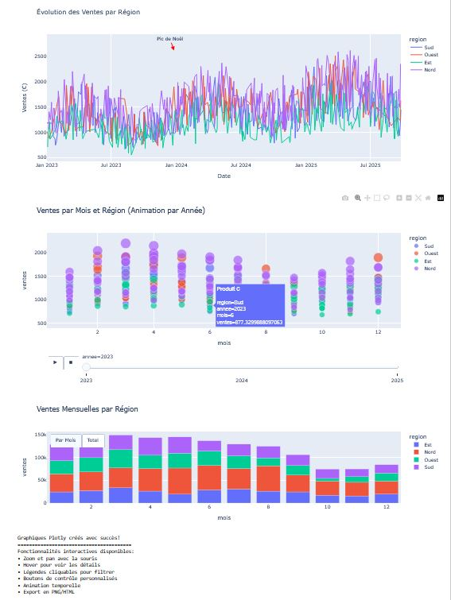
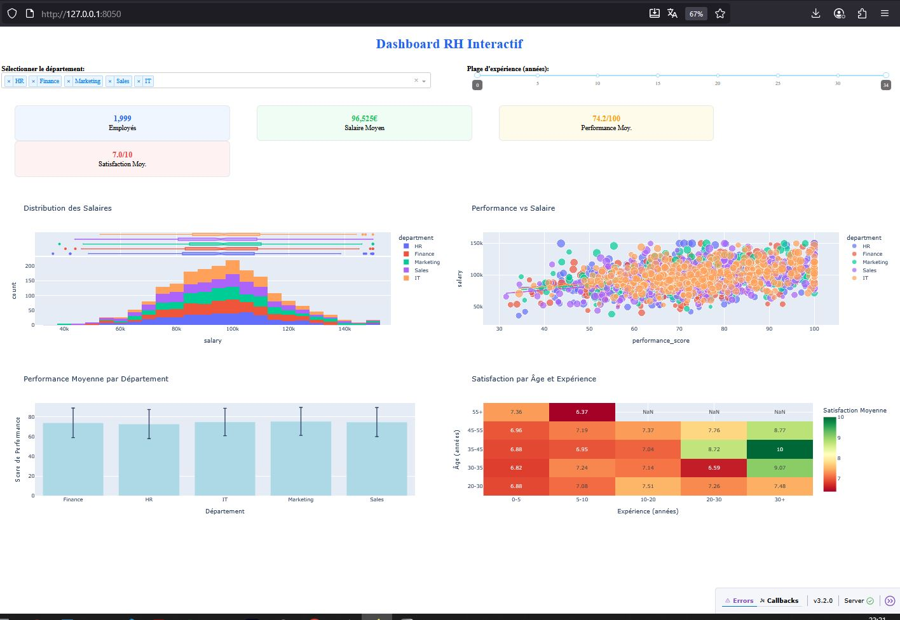
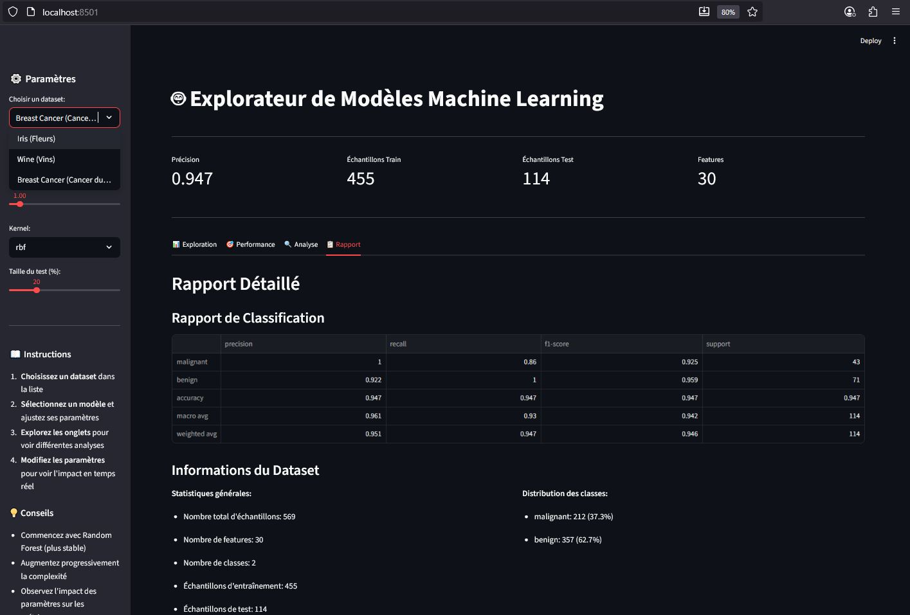
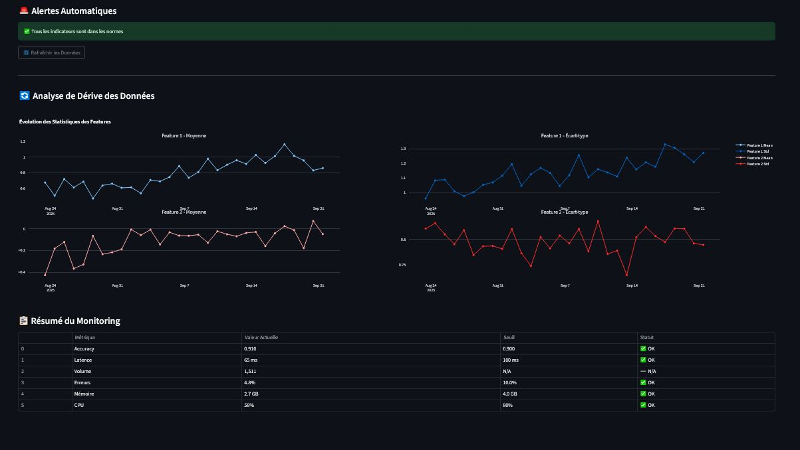
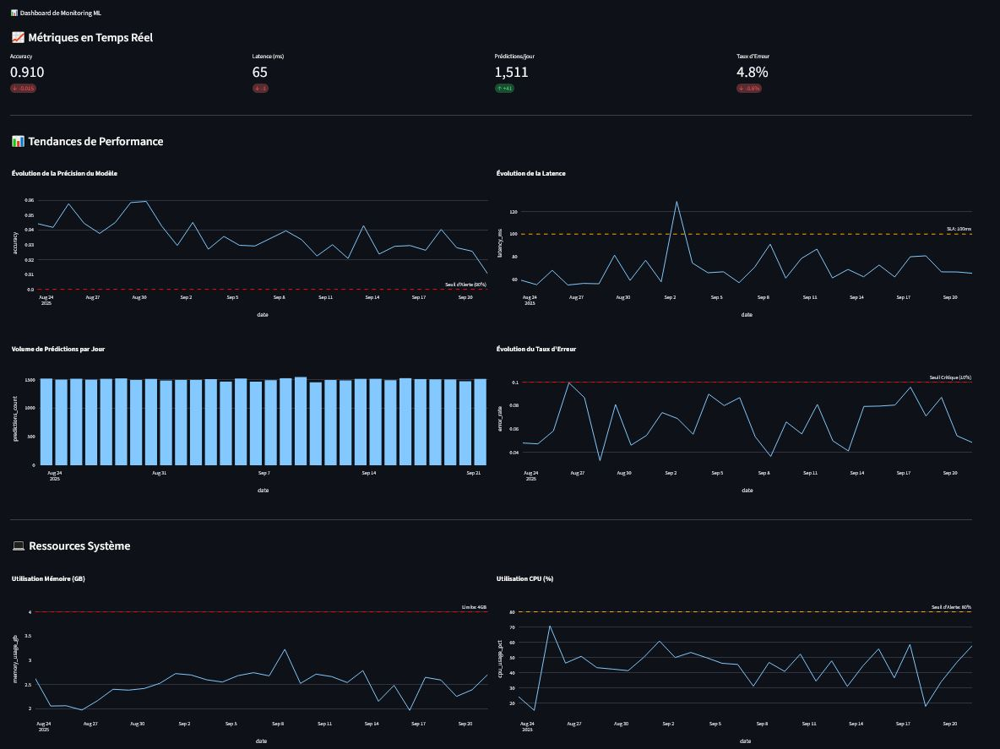

# 📊 5.5 – Dashboards interactifs
**Module 5 • Chapitre 5 • Niveau : Débutant • Durée : ~40-45 min**

## 🎯 Objectif
Passer des graphiques statiques aux **dashboards dynamiques** pour explorer vos données et modèles en temps réel.

---

## 🚀 Ce que vous allez apprendre
- Introduction aux **dashboards interactifs**
- Utilisation de **Plotly** pour des graphiques dynamiques
- Création d’applications web simples avec **Streamlit**
- Exploration interactive avec les **widgets Jupyter**
- Construire un **dashboard ML complet**

---

## ❓ Pourquoi des dashboards interactifs ?
Les graphiques statiques ont leurs limites.  
L’interactivité ajoute une nouvelle dimension :

> *"Un dashboard interactif vaut mille graphiques statiques"*

### ✅ Avantages
- Exploration en temps réel  
- Filtrage dynamique des données  
- Zoom et navigation aisés  
- Mise à jour automatique  
- Partage facile avec les équipes  

### 🔎 Cas d’usage typiques
- Monitoring de modèles en production  
- Exploration de datasets complexes  
- Présentation de résultats à des clients  
- Analyse collaborative  
- Prototypage rapide  

---
# 🚀 Introduction à Streamlit

Streamlit est une bibliothèque Python qui permet de transformer rapidement des scripts en **applications web interactives** pour la data science.

---

## ⚙️ Installation

Assurez-vous d’avoir activé votre environnement virtuel (`(venv-dashboards)`).

```bash
pip install streamlit==1.28.1

```python
import plotly.express as px
import pandas as pd

# Exemple simple avec le dataset intégré "iris"
df = px.data.iris()

fig = px.scatter(
    df, 
    x="sepal_width", 
    y="sepal_length", 
    color="species", 
    size="petal_length",
    hover_data=["petal_width"]
)

fig.show()
```

## 📌 Introduction à Plotly – Graphiques interactifs
### 1. Premiers pas avec Plotly
Objectif : **Créer des graphiques interactifs** avec zoom, hover et filtres.

# 📊 Ventes – Graphiques interactifs (Plotly)

Ce document décrit et interprète trois visualisations interactives des ventes par **région**, **mois** et **année**.



---

## 1) Évolution des Ventes par Région (courbes)

**Ce que montre le graphique**
- **Axes** : l’axe X est la **date** (chronologie sur ~2 ans), l’axe Y le **montant des ventes**.
- **Couleurs** : chaque couleur correspond à une **région** (Nord, Sud, Est, Ouest).
- **Annotation** : un marqueur indique un **« Pic de Noël »**, typique des hausses de fin d’année.

**Comment le lire**
- Identifie les **tendances** (croissance/décroissance générale par région).
- Repère la **saisonnalité** (pics récurrents, creux estivaux, fêtes de fin d’année).
- Compare la **volatilité** : une région très « jaggy » varie beaucoup semaine après semaine.

**Interactions utiles**
- **Survol** pour connaître la valeur précise à une date donnée.
- **Zoom**/glisser pour te focaliser sur un trimestre.
- **Clic sur la légende** pour isoler/masquer une région et comparer proprement.

**À retenir**
- Pic marqué en décembre (effet promotions/fêtes).  
- Si une région s’écarte durablement des autres, cela peut révéler un **problème d’offre/logistique** ou au contraire une **opportunité** (campagne locale efficace).

---

## 2) Ventes par Mois et Région — *Animation par Année* (nuage de points)

**Ce que montre le graphique**
- **Axes** : X = **mois (1–12)**, Y = **ventes**.
- **Couleurs** : régions.  
- **Animation** : un **curseur d’année** permet de jouer/comparer les années.
- **Info-bulle** : détail du **produit**, **région**, **année**, **mois**, **ventes**.

**Comment le lire**
- La **dispersion verticale** à un mois donné montre la **variabilité** (ex. plusieurs produits/segments).
- La **position des points** par région révèle les **mois forts/faibles** localement (ex. Sud plus haut en été).
- L’**animation** permet de voir comment ces patterns **changent d’une année à l’autre** (effet d’un nouveau catalogue, météo, inflation, etc.).

**Interactions utiles**
- **Jouer la timeline** (▶︎) pour observer l’évolution globale.
- **Pause** sur une année pour analyser les écarts régionaux mois par mois.
- **Sélection** d’une région via la légende pour suivre sa courbe de saisonnalité.

**À retenir**
- Idéal pour repérer des **mois clés** par région et vérifier si ces pics sont **récurrents** (saison) ou **ponctuels** (opération).

---

## 3) Ventes Mensuelles par Région (barres empilées)

**Ce que montre le graphique**
- **Barres empilées** : chaque mois (X) affiche un **total de ventes** (hauteur) et la **contribution de chaque région** (couleurs empilées).
- Lecture immédiate du **total mensuel** et de la **part relative** des régions.

**Comment le lire**
- La **hauteur totale** = performance globale du mois (repère les meilleurs/pires mois).
- La **taille du segment** par région = **part de marché relative** ce mois-là.
- Les **changements de composition** (ex. une région prend plus de place) signalent un **déplacement de la demande**.

**Interactions utiles**
- **Clic sur la légende** pour masquer/afficher une région → recalcul visuel des parts.
- **Survol** pour lire la valeur exacte par région et le total du mois.

**À retenir**
- Graphique parfait pour suivre la **contribution régionale** au **P&L mensuel** et détecter des **gains/pertes de part**.

---

## Synthèse & pistes d’analyse

- **Saisonnalité forte** confirmée par la courbe (pic de Noël) et les points concentrés en fin d’année.  
- **Hétérogénéité régionale** : le nuage de points + l’empilé mensuel montrent quelles régions sur- ou sous-performent selon les mois.  
- **Actionnables** :
  - Ajuster les **stocks** et **promos** avant les pics (Q4).
  - Déployer des **campagnes ciblées** là où la part régionale recule.
  - Vérifier l’**effet produit** (info-bulle) : un produit tire-t-il une région particulière ?

---

## Astuces d’usage (Plotly)

- **Zoom** et **pan** pour inspecter un intervalle précis.  
- **Désactiver** des séries via la légende pour comparer proprement.  
- **Exporter** : bouton **camera** pour enregistrer un PNG, ou exporter l’HTML du graphique pour partage.

#2. Dashboard avec Plotly Dash
##Objectif : Créer une application web complète avec graphiques interactifs

# 🧑‍💼 Dashboard RH Interactif

Ce tableau de bord interactif permet d’analyser les **données des employés** par département, âge, expérience et performance.  
Il est construit avec **Dash/Plotly** et propose plusieurs filtres pour une exploration dynamique.



---

## 1️⃣ Indicateurs principaux (KPI)

En haut de l’écran, trois indicateurs résument la population filtrée :

- **1 999 Employés** → effectif total analysé.  
- **96 525 € Salaire Moyen** → rémunération moyenne sur l’échantillon.  
- **74,2/100 Performance Moyenne** → score de performance global.  
- **7,0/10 Satisfaction Moyenne** → note moyenne de satisfaction des employés.

💡 Ces KPI changent selon les filtres (département, plage d’expérience).

---

## 2️⃣ Distribution des Salaires (Histogramme empilé)

**Description**
- Axe X : montant du **salaire**.  
- Axe Y : **effectif** (nombre d’employés).  
- Couleurs : départements (HR, Finance, Marketing, Sales, IT).  

**Analyse**
- La courbe montre une distribution proche d’une **loi normale** (pic autour de 100 000 €).  
- Chaque couleur montre la **répartition par département** → certains départements ont plus de salariés dans les tranches hautes/basses.

**Utilité**
- Repérer des **écarts de rémunération** entre départements.  
- Détecter des anomalies (trop d’employés très bas ou très hauts salaires).

---

## 3️⃣ Performance vs Salaire (Nuage de points)

**Description**
- Axe X : **score de performance** (0–100).  
- Axe Y : **salaire**.  
- Chaque point = un employé, coloré par département.

**Analyse**
- La dispersion montre qu’un **meilleur score de performance** est globalement associé à un **salaire plus élevé**.  
- Toutefois, il existe de la **variabilité** (certains employés très performants mais peu payés → opportunité d’ajustement RH).  
- Les nuages par couleur permettent de comparer les départements (ex. IT vs Sales).

**Utilité**
- Vérifier la **corrélation performance ↔ salaire**.  
- Identifier des **écarts de traitement** à poste équivalent.

---

## 4️⃣ Performance Moyenne par Département (Barres avec intervalles de confiance)

**Description**
- Chaque barre = un département.  
- Hauteur = **moyenne des scores de performance**.  
- Barres verticales = **intervalle de confiance** (variabilité intra-département).

**Analyse**
- Permet de comparer les **départements entre eux**.  
- Ex. si Marketing < IT → potentiel besoin de **formations ciblées**.  
- Un intervalle de confiance large = performance très hétérogène dans ce département.

**Utilité**
- Orienter les politiques de **formation** et d’**encadrement**.  
- Définir des objectifs réalistes selon la distribution interne.

---

## 5️⃣ Satisfaction par Âge et Expérience (Heatmap)

**Description**
- Axe X : **expérience (années)** → 0–5, 5–10, 10–20, 20–30, 30+.  
- Axe Y : **tranche d’âge** → 20–25, 25–30, …, 45–55.  
- Couleurs = **note moyenne de satisfaction** (0–10).  

**Analyse**
- Les cases montrent les combinaisons âge/expérience.  
- Ex. forte satisfaction chez les **employés expérimentés (30+ ans d’exp.)** et certains jeunes profils.  
- Des zones plus rouges indiquent des tranches **moins satisfaites** (ex. 30–35 ans avec 20–30 ans d’expérience).

**Utilité**
- Identifier des **populations à risque de turnover**.  
- Ajuster des politiques RH selon la **carrière** (mentorat, mobilité interne, reconnaissance salariale).

---

## 6️⃣ Filtres interactifs

En haut du dashboard :
- **Sélecteur de département** → pour isoler HR, IT, Sales, etc.  
- **Plage d’expérience (slider)** → permet de comparer juniors vs seniors.  

💡 Ces filtres mettent à jour **tous les graphiques** et les KPI.

---

## 🎯 Synthèse

- Les **salaires** suivent une distribution normale avec quelques écarts selon les départements.  
- La **corrélation performance ↔ salaire** existe mais n’est pas parfaite → ajustements RH possibles.  
- La **satisfaction** varie fortement selon l’âge et l’expérience → point crucial pour la rétention des talents.  
- Le dashboard permet aux RH de **cibler les actions** (formations, augmentations, politiques de motivation).

---

# 🧪Streamlit - Applications ML interactives
##1. Application Streamlit complète
##Objectif : Créer une application web pour explorer des modèles ML

Cet outil Streamlit permet d’explorer rapidement plusieurs **datasets classiques** (Iris, Vin, Breast Cancer), de **tester un modèle** (ex. SVM, Random Forest), d’ajuster les **hyperparamètres**, et de visualiser **métriques, rapports et distributions** — le tout en temps réel.



# 🤖 Explorateur de Modèles Machine Learning

Ce dashboard interactif permet d’explorer différents modèles de classification sur des jeux de données standards (Iris, Wine, Breast Cancer).  
Il fournit une interface intuitive pour sélectionner un dataset, ajuster les hyperparamètres et visualiser les performances.

---

## 🎛️ Panneau de Paramètres (à gauche)

- **Choisir un dataset** : liste déroulante permettant de sélectionner un jeu de données :
  - *Iris* : classification de fleurs
  - *Wine* : caractéristiques de vins
  - *Breast Cancer* : détection de tumeurs bénignes ou malignes  

- **Kernel** : choix de la fonction noyau (ici `rbf`) pour un modèle SVM.  

- **Taille du test (%)** : curseur définissant la proportion des données réservées au test (ici 20%).  

- **Instructions** : rappels étape par étape pour utiliser l’explorateur :
  1. Choisissez un dataset  
  2. Sélectionnez un modèle et ajustez ses paramètres  
  3. Explorez les onglets d’analyses  
  4. Modifiez les paramètres et observez l’impact en temps réel  

- **Conseils** :  
  - Commencez avec Random Forest (plus stable)  
  - Augmentez progressivement la complexité  
  - Observez l’impact des hyperparamètres  

---

## 📊 Indicateurs de Performance (en haut)

- **Précision** : 0.947 (94,7% d’exactitude globale du modèle).  
- **Échantillons Train** : 455 données utilisées pour l’entraînement.  
- **Échantillons Test** : 114 données réservées pour l’évaluation.  
- **Features** : 30 variables explicatives utilisées par le modèle.  

Ces indicateurs donnent une vue synthétique de la robustesse du modèle entraîné.

---

## 📑 Rapport Détailé (onglet sélectionné)

### Rapport de Classification
Tableau affichant les principales métriques pour chaque classe :

| Classe      | Precision | Recall | F1-Score | Support |
|-------------|-----------|--------|----------|---------|
| **malignant** | 0.922     | 1.000  | 0.86     | 43      |
| **benign**    | 1.000     | 0.959  | 0.98     | 71      |
| **accuracy**  | -         | -      | 0.947    | 114     |
| **macro avg** | 0.961     | 0.930  | 0.93     | 114     |
| **weighted avg** | 0.951 | 0.947  | 0.94     | 114     |

- **Precision** : proportion de prédictions correctes parmi celles données par le modèle.  
- **Recall** : proportion d’éléments correctement identifiés parmi la classe réelle.  
- **F1-Score** : moyenne harmonique de precision et recall (équilibre).  
- **Support** : nombre d’échantillons par classe.  

➡️ Résultat : le modèle est particulièrement performant pour détecter les cas bénins, tout en restant très bon pour les cas malins.

---

### Informations du Dataset

- **Nombre total d’échantillons** : 569  
- **Nombre de features** : 30  
- **Nombre de classes** : 2 (*malignant* et *benign*)  
- **Échantillons d’entraînement** : 455  
- **Échantillons de test** : 114  

#### Distribution des classes
- **Malignant** : 212 (37,3%)  
- **Benign** : 357 (62,7%)  

➡️ Les classes sont légèrement déséquilibrées (plus de cas bénins que malins), ce qui peut influencer le recall.

---

## 🎯 Interprétation Globale

- Le modèle atteint une précision élevée (**94,7%**), adaptée pour une tâche médicale sensible.  
- Les métriques montrent un bon compromis entre **rappel** (ne pas manquer de cas malins) et **précision** (éviter les faux positifs).  
- La répartition train/test est équilibrée, garantissant une évaluation fiable.  

👉 Ce type de dashboard permet aux Data Scientists et praticiens de **tester rapidement différents modèles et configurations** pour observer leur impact sur la performance.


---

# 📊 Dashboard de Monitoring – Analyse Détaillée





Ce dashboard illustre un système de **surveillance en temps réel** des modèles de Machine Learning. Il est composé de plusieurs sections qui fournissent des informations sur l’état du système, la dérive des données et les performances opérationnelles.

---

## 🔔 Alertes Automatiques

- **Barre verte** : indique que *tous les indicateurs sont dans les normes*.  
- Cela signifie qu’aucun seuil critique n’a été dépassé (précision, latence, mémoire, etc.).  
- Le bouton **« Rafraîchir les Données »** permet de mettre à jour les graphiques et les métriques en direct.

---

## 📈 Analyse de Dérive des Données

Cette partie mesure la **stabilité des données d’entrée** utilisées par le modèle.  
Une dérive trop importante peut indiquer que les données de production ne ressemblent plus aux données d’entraînement, ce qui risque de réduire la performance du modèle.

### Graphiques à gauche – *Moyenne des features*
- **Feature 1 – Moyenne (ligne bleue)** : montre l’évolution de la valeur moyenne de la première variable explicative.  
  - Ici, la moyenne reste relativement stable avec une légère tendance haussière.  
- **Feature 2 – Moyenne (ligne rouge)** : suit la moyenne de la deuxième variable.  
  - On observe des fluctuations mais elle reste proche de zéro, ce qui est acceptable.  

➡️ Ces courbes permettent de détecter un éventuel *shift de distribution*.

### Graphiques à droite – *Écart-type des features*
- **Feature 1 – Écart-type (bleu)** : mesure la variabilité des données pour la Feature 1.  
  - On observe des oscillations normales, signe d’une variabilité stable.  
- **Feature 2 – Écart-type (rouge)** : suit la dispersion de la Feature 2.  
  - Ici aussi, les variations sont régulières, aucune dérive anormale détectée.  

➡️ Une hausse brutale de l’écart-type signalerait une instabilité dans les données.

---

## 📊 Résumé du Monitoring

Ce tableau présente les **indicateurs clés du modèle et du système**, comparés aux seuils attendus.

| Métrique   | Valeur Actuelle | Seuil | Statut | Interprétation |
|------------|----------------|-------|--------|----------------|
| **Accuracy** | 0.910 | 0.900 | ✅ OK | Le modèle conserve une précision au-dessus du seuil critique. |
| **Latence** | 65 ms | 100 ms | ✅ OK | Les prédictions sont rapides, en dessous de la limite fixée. |
| **Volume** | 1,511 | N/A | ✅ N/A | Nombre d’échantillons traités, indicatif de la charge du système. |
| **Erreurs** | 4.9% | 10% | ✅ OK | Taux d’erreurs reste sous contrôle. |
| **Mémoire** | 2.7 GB | 4.0 GB | ✅ OK | La consommation mémoire est dans la limite autorisée. |
| **CPU** | 56% | 80% | ✅ OK | L’utilisation du processeur reste modérée. |

---

## 🎯 Interprétation Globale

- ✅ Tous les indicateurs sont **dans le vert** : le système est stable.  
- 📉 Aucune dérive majeure détectée sur les features surveillées.  
- 🚦 Le tableau de monitoring montre une **marge de sécurité confortable** (accuracy > seuil, latence < limite, mémoire < seuil).  

En résumé, le modèle est **opérationnel et fiable** dans ce contexte de monitoring continu.

------





# 📊 Dashboard de Monitoring ML — Explication détaillée

Ce tableau de bord suit en continu la **santé d’un modèle de Machine Learning** et de son **infrastructure**.  
Il se compose de 3 zones : **Métriques en Temps Réel**, **Tendances de Performance**, et **Ressources Système**.


---

## 1) 🟢 Métriques en Temps Réel (cartes KPI)

- **Accuracy : 0.910**  
  Proportion des prédictions correctes sur la fenêtre d’observation récente.  
  > Interprétation : au-dessus du seuil de 0.90 → **OK** (modèle globalement fiable).

- **Latence (ms) : 65**  
  Temps moyen pour retourner une prédiction (du `request_in` à `response_out`).  
  > Interprétation : inférieur au seuil de 100 ms → **OK** (service réactif).

- **Prédictions/jour : 1 511**  
  Volume traité sur 24h. Sert à détecter des changements de trafic (pics/sous-charge).  
  > Interprétation : volume stable → **OK** (charge régulière).

- **Taux d’Erreur : 4.8%**  
  Part des requêtes en échec (exceptions, timeouts) **ou** des prédictions explicitement invalidées par des règles métiers.  
  > Interprétation : sous le seuil critique de 10% → **OK**.

**À retenir** : les quatre KPI sont **dans le vert**. Aucune alerte immédiate.

---

## 2) 📈 Tendances de Performance (séries temporelles)

### 2.1 Évolution de la Précision du Modèle (ligne)
- **Ce que l’on voit** : la précision quotidienne (ou par créneau horaire) avec une **ligne de seuil d’alarme à 0.90** (pointillés rouges).  
- **Comment lire** : la courbe reste au-dessus du seuil, avec de légères oscillations.  
- **Ce que ça implique** : **pas de dérive de performance** significative. Les variations normales peuvent venir du mix utilisateurs, des versions de données, ou de la saisonnalité.

**Actions si anomalie**  
- Si la précision passe **sous 0.90** de manière persistante :  
  1) vérifier les **données d’entrée** (schéma, encodage, features manquantes),  
  2) comparer les distributions production vs entraînement (**dérive**),  
  3) réévaluer le **seuil de décision** ou relancer un **réentraînement**.

---

### 2.2 Évolution de la Latence (ligne)
- **Ce que l’on voit** : la latence moyenne avec une **ligne d’alerte ~80–100 ms** (pointillés jaunes/oranges selon l’implémentation).  
- **Observation** : une ou deux **pointes** (spikes) ponctuelles, sinon la plupart des points **< 80 ms**.  
- **Interprétation** : service **globalement fluide** ; les pics pourraient correspondre à des **pics de charge**, **GC**, ou une **dépendance externe** lente.

**Actions si anomalie**  
- Si des pics se multiplient :  
  - activer un suivi **p95/p99** (latence queue),  
  - **cache** sur features ou sorties souvent réutilisées,  
  - profiling (CPU/GPU), connection pooling, **autoscaling**.

---

### 2.3 Volume de Prédictions par Jour (barres)
- **Ce que l’on voit** : barres quasi constantes autour de **1 500 prédictions/jour**.  
- **Interprétation** : trafic **stable** → idéal pour comparer les performances à périmètre constant.  
- **Utilité** : un **effondrement** ou une **explosion** du volume peut expliquer des changements de latence/erreurs (ex. afflux marketing, incident amont/aval).

---

### 2.4 Évolution du Taux d’Erreur (ligne)
- **Ce que l’on voit** : ligne avec **seuil critique à 10%** (pointillés rouges).  
- **Observation** : oscillations dans une plage **3–8%**, quelques crêtes mais **sous 10%**.  
- **Interprétation** : erreurs **contenues** ; surveiller les montées corrélées (ex. hausse latence + erreurs = saturation).

**Actions si anomalie**  
- Si > 10% ou croissance continue :  
  - inspecter logs/trace **par code d’erreur** (timeout, 5xx, validation),  
  - vérifier **versions** (modèle, feature store, schémas),  
  - mettre en place **circuit breaker** et **retries**.

---

## 3) 🖥️ Ressources Système

### 3.1 Utilisation Mémoire (GB) — avec **Limite 4 GB**
- **Ce que l’on voit** : tendance globale **montante mais sous 4 GB**.  
- **Interprétation** : pas de fuite évidente. Les **micro-spikes** peuvent être liés aux batchs ou au chargement de modèles.

**Actions si anomalie**  
- Si dépassements fréquents de la **limite 4 GB** :  
  - charger le modèle **une seule fois** (singleton),  
  - libérer les buffers temporaires,  
  - réduire la **taille de batch**,  
  - activer une **limitation de concurrence** (workers).

---

### 3.2 Utilisation CPU (%) — **Seuil d’alerte ~80%**
- **Ce que l’on voit** : une **grosse montée** initiale, puis une stabilisation **< 60%** la plupart du temps, avec quelques oscillations.  
- **Interprétation** : capacité **disponible** ; les pics peuvent coïncider avec des recalculs, un **autoscaling** ou le **warm-up**.

**Actions si anomalie**  
- Si > 80% de façon persistante :  
  - augmenter le **replica count** / autoscaler,  
  - profiler le code (vectorisation, I/O),  
  - épurer les pré/post-traitements lour


# ✅ Bonnes pratiques pour les dashboards

## 🎨 Design UX
| Bonnes pratiques | Explication |
|------------------|-------------|
| Interface intuitive et claire | Un design épuré facilite la compréhension immédiate. |
| Temps de chargement rapide | Les utilisateurs n’attendent pas → meilleure expérience. |
| Responsive design | Le tableau de bord s’adapte aux écrans (desktop, tablette, mobile). |
| Navigation facile | Accès rapide aux sections → gain de temps. |
| Feedback visuel immédiat | L’utilisateur reçoit une confirmation ou un retour instantané (ex. chargement, mise à jour). |

---

## ⚡ Performance
| Bonnes pratiques | Explication |
|------------------|-------------|
| Cache des données coûteuses | Évite de recalculer sans cesse les mêmes requêtes lourdes. |
| Pagination pour gros datasets | Améliore la vitesse en affichant par lot. |
| Chargement asynchrone | Permet de charger certaines parties sans bloquer tout le dashboard. |
| Optimisation des requêtes | Réduit le temps de réponse côté base de données/API. |
| Compression des données | Accélère le transfert entre serveur et client. |

---

## 🔧 Maintenance
| Bonnes pratiques | Explication |
|------------------|-------------|
| Code modulaire et réutilisable | Favorise la maintenabilité et réduit les duplications. |
| Configuration externalisée | Paramètres gérés hors du code (fichiers `.env`, `.yaml`). |
| Logging et monitoring | Suivi des erreurs et performances pour anticiper les pannes. |
| Tests automatisés | Garantissent la fiabilité lors des mises à jour. |
| Documentation utilisateur | Facilite la prise en main par d’autres personnes. |

---

# 🛠️ Outils et technologies recommandés

| Outil             | Type                        | Avantages                                   | Cas d’usage                                |
|-------------------|-----------------------------|---------------------------------------------|--------------------------------------------|
| **Plotly**        | Graphiques interactifs      | Riche, interactif, prêt pour le web         | Graphiques complexes, export web           |
| **Streamlit**     | Application web             | Simple, rapide, Python pur                  | Prototypes, démonstrations                 |
| **Dash**          | Dashboard web               | Très personnalisable, robuste               | Applications de production                 |
| **Jupyter Widgets** | Notebooks interactifs     | Intégré à Jupyter, exploration rapide       | Recherche, prototypage                     |
| **Bokeh**         | Visualisation web           | Haute performance, big data                 | Grandes datasets, temps réel               |

---

📌 **Conseil pratique** :  
Commencez par **Streamlit** pour prototyper rapidement, utilisez **Plotly** pour les graphiques avancés, et migrez vers **Dash** pour une mise en production robuste.  
Pour la recherche exploratoire → **Jupyter Widgets**, et pour les très gros volumes de données → **Bokeh**.

# 🚀 Exercice Pratique Guidé — Créez votre premier Dashboard

👉 Suivez ces **7 étapes** pour construire un dashboard interactif de A à Z :

---

## 📋 Étapes à suivre

1️⃣ **Préparation** 🛠️  
Créez l’environnement virtuel et installez les dépendances nécessaires.

2️⃣ **Dataset** 📊  
Choisissez un dataset qui vous intéresse (Iris, Titanic, ou vos propres données).

3️⃣ **Graphiques** 📈  
Créez 3-4 graphiques **Plotly interactifs** dans le dossier `scripts/`.

4️⃣ **Application** 💻  
Développez une application **Streamlit** dans le dossier `streamlit_apps/`.

5️⃣ **Interactivité** 🎛️  
Ajoutez des filtres et des contrôles utilisateurs pour enrichir l’expérience.

6️⃣ **Test** ✅  
Lancez l’application et vérifiez que toutes les fonctionnalités marchent.

7️⃣ **Partage** 🤝  
Montrez vos dashboards à des collègues et collectez leurs retours pour améliorer.

---

## ✅ Checklist de validation

### 🌍 Environnement
- ✔️ Environnement virtuel créé et activé  
- ✔️ Toutes les dépendances installées  
- ✔️ Script de test exécuté avec succès  
- ✔️ Structure de projet créée  
- ✔️ `requirements.txt` généré  

### 📦 Applications
- ✔️ Dashboard **Streamlit** fonctionnel  
- ✔️ Application **Dash** testée  
- ✔️ Widgets **Jupyter** opérationnels  
- ✔️ Graphiques **Plotly** interactifs  
- ✔️ Monitoring dashboard créé  

---

✨ **Astuce bonus :**  
N’ayez pas peur de tester plusieurs datasets et de varier les graphiques (histogrammes, heatmaps, barres empilées, séries temporelles).  
Un bon dashboard = **clarté + interactivité + esthétique** 🎨

-------------


---------------
