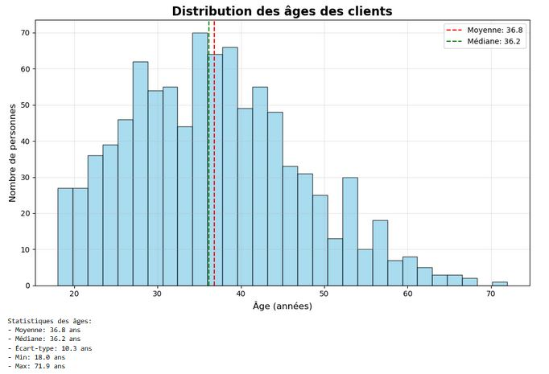
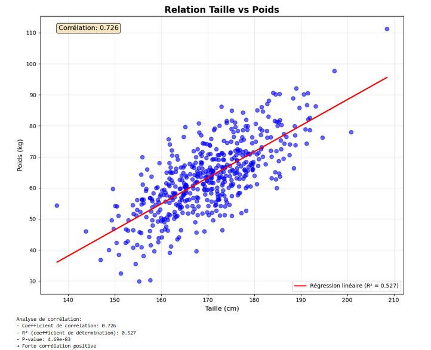
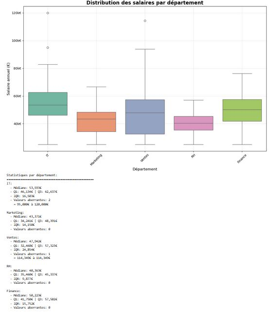
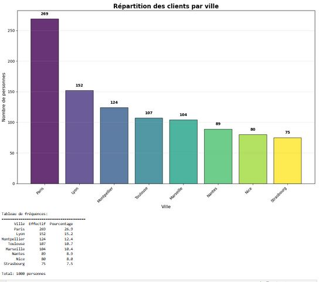
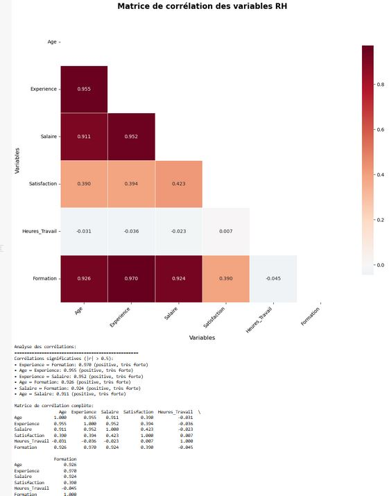
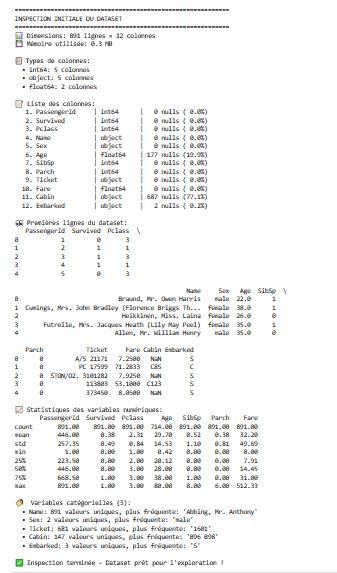

# 🕵️‍♀️ L'approche EDA (Exploratory Data Analysis)

> *“Regarder vos données avant de les modéliser, c’est comme observer une scène de crime avant d’accuser quelqu’un.”*

L’**Analyse Exploratoire des Données (EDA)** est l’étape **la plus importante** — et trop souvent négligée — avant d’entraîner un modèle de Machine Learning.

## 📌 C’est quoi exactement ?

Imaginez que vous êtes un détective. À votre arrivée sur une scène de crime :
- Vous **n’accusez pas tout de suite**
- Vous **observez**, **collectez les indices**, **analysez les faits**
- Ensuite seulement, vous **formulez des hypothèses**

L’EDA fonctionne **exactement pareil** avec les données.

---

## ⚠️ Erreur fréquente chez les débutants

Beaucoup de personnes foncent directement vers un **algorithme ML**, sans même comprendre leur dataset. C’est comme :

> *Essayer de cuisiner sans vérifier ce qu’il y a dans le frigo. Résultat : désastre assuré !* 🍳❌

---

## 🧪 L’EDA : votre check-up médical pour les données

Voici les **5 grands axes** de l’EDA :

| Étape               | Objectif                                                   |
|---------------------|------------------------------------------------------------|
| **Vue d'ensemble**  | Dimensions, noms de colonnes, types de données             |
| **Qualité**         | Détection de valeurs manquantes, doublons                  |
| **Distributions**   | Observer la répartition des variables                      |
| **Relations**       | Corrélations, dépendances entre variables                  |
| **Anomalies**       | Valeurs extrêmes, erreurs de saisie, outliers              |

---

# 📊 Histogramme : voir la "personnalité" d’une variable

## 🧺 Qu’est-ce qu’un histogramme ?

> C’est comme **ranger vos chaussettes** par couleur dans des tiroirs.

Un histogramme découpe une variable **numérique** en intervalles (appelés **bins**) et compte combien de valeurs tombent dans chaque tiroir.

---

## 📈 Pourquoi c’est utile ?

L’histogramme vous montre **la forme de la distribution** :

| Type de distribution       | Description                                           | Exemple                                |
|----------------------------|-------------------------------------------------------|----------------------------------------|
| 📘 Normale (gaussienne)     | Forme en cloche                                       | Notes d’un examen équilibré            |
| 🟠 Asymétrique              | Penche d’un côté                                      | Salaires (majorité faibles, rares gros)|
| 🟣 Bimodale                | Deux pics distincts                                   | Âges dans un magasin de jouets         |
| 🟩 Uniforme                | Même fréquence partout                                | Lancer de dé parfait                   |

---

## 📌 Exemple concret

Vous analysez l’âge de vos clients :

- L’histogramme montre un **pic entre 25-35 ans**
- ➤ Votre produit plaît surtout aux **jeunes adultes**
- ➤ Cette info influence votre **marketing**, **tarification**, et même vos **horaires d’ouverture**

---

## 🛠️ Quand l’utiliser ?

Dès que vous avez une **variable numérique** (âge, prix, température, etc.)  
➡️ **C’est toujours votre premier réflexe en EDA !**

---

## 📷 Illustration

# 🔵 Nuage de points – Relation entre deux variables

## 🌳 C’est quoi un nuage de points ?

Imaginez que vous êtes dans un parc 🌳 et que vous voulez savoir s'il y a un lien entre **la taille des arbres** et **leur âge**.  
Vous mesurez plein d'arbres et vous placez un point sur un graphique :
- **X** = taille
- **Y** = âge

🟢 Si les points forment une ligne qui monte : plus un arbre est vieux, plus il est grand !

---

## 🧠 Pourquoi c'est magique ?

Le **nuage de points révèle les relations cachées** entre vos variables.  
C'est comme mettre des **lunettes à rayons X** pour vos données.

### ⚠️ Attention au piège !

> **Corrélation ≠ causalité**

Exemple : Les ventes de glaces et les noyades augmentent en même temps ?  
➡️ Ce n’est pas parce que les glaces causent les noyades… c’est **l'été** la vraie cause commune ! ☀️🍦🏊

---

## 🔍 Ce que vous pouvez découvrir

| Type de relation        | Description                                        | Exemple                            |
|-------------------------|----------------------------------------------------|------------------------------------|
| 📈 Corrélation positive | Quand une variable augmente, l'autre aussi         | Taille et pointure de chaussures   |
| 📉 Corrélation négative | Quand une augmente, l'autre diminue                | Prix et demande                    |
| ❌ Pas de corrélation   | Aucun pattern visible                              | Couleur des yeux et QI             |
| 🔁 Non-linéaire         | Les points forment une courbe                      | Vitesse et consommation d’essence  |

---

## 🛍️ Exemple e-commerce

Vous analysez le **temps passé sur un site** vs le **montant des achats** :

- Moins de 2 minutes → Trop pressé
- 5 à 10 minutes → Achats maximisés 🛒✅
- Plus de 15 minutes → Indécision, moins d’achats

➡️ Le nuage de points peut révéler un **point optimal** de conversion !

---

## 📷 Illustration

## 📦 Interprétation du Boxplot par couleur

La graphique montre la **distribution des salaires** dans plusieurs départements (IT, Marketing, Ventes, RH, Finance), avec des **boîtes de couleur** représentant chaque département.

### 🟦 IT (bleu-vert)
- **Médiane** la plus élevée (~53 503 €)
- **Boîte très étendue** (Q1 à Q3) → grande dispersion des salaires
- **Deux valeurs aberrantes très élevées** (jusqu’à 120 000 €)
- 👉 *Certains postes très bien rémunérés (ex. : architectes logiciels)*

### 🟧 Marketing (orange)
- **Médiane plus basse** (~43 273 €)
- **Distribution plus concentrée** (petite boîte)
- 👉 *Salaires plus homogènes, mais globalement plus bas*

### 🟪 Ventes (violet)
- **Médiane intermédiaire** (~47 934 €)
- **Variabilité importante** (boîte large)
- **1 valeur aberrante élevée (~114 394 €)**
- 👉 *Certains commerciaux touchent des bonus/salaires très élevés*

### 🟫 RH (rose clair)
- **Médiane plus faible** (~40 488 €)
- **Boîte étroite** → faible dispersion
- 👉 *Salaires uniformes, peu de variation dans ce département*

### 🟩 Finance (vert olive)
- **Médiane solide** (~50 228 €)
- **Distribution stable** (pas d’outliers)
- 👉 *Bon équilibre entre stabilité et compétitivité salariale*

---

### 🔍 Tableau comparatif

| Couleur   | Département | Médiane (€) | Outliers | Interprétation rapide                         |
|-----------|-------------|-------------|----------|-----------------------------------------------|
| 🟦 Bleu-vert | IT          | ~53 503     | Oui      | Hauts salaires, hétérogènes, profils rares    |
| 🟧 Orange   | Marketing   | ~43 273     | Non      | Salaires modestes et homogènes                |
| 🟪 Violet   | Ventes      | ~47 934     | Oui      | Forte variabilité, bonus possibles            |
| 🟫 Rose     | RH          | ~40 488     | Non      | Le plus uniforme et bas                       |
| 🟩 Vert     | Finance     | ~50 228     | Non      | Compromis stable, aucun extrême               |

---

### ✅ Conclusion

- Le **département IT** présente des **écarts extrêmes**, révélant des postes très spécialisés.
- Le **département RH** est le plus **prévisible** en termes de salaire.
- La **finance** reste **solide et équilibrée**, sans surprise.
- Le **boxplot coloré** permet en un coup d'œil de **comparer l’équité et la variabilité** des salaires entre groupes.

# 📦 Boxplot – Résumé statistique visuel

## 📐 Qu’est-ce qu’un boxplot ?

Imaginez que vous voulez **résumer la taille de tous les élèves de votre école** en un seul dessin.  
➡️ Le boxplot le fait parfaitement : **un résumé compact de toute votre distribution**.

---

## 🧠 Pourquoi c’est génial ?

En **un coup d’œil**, le boxplot vous dit tout :

- 📍 Où se situe la **valeur typique** (la **médiane**)
- 📦 Où se trouvent **50% des gens** (la boîte entre Q1 et Q3)
- 📏 Où se trouvent **99% des cas** (les **moustaches**)
- ⚠️ Qui sont les **valeurs aberrantes** (les points isolés)

> 🩺 **Analogie pratique** : c’est comme un **thermomètre** de vos données !  
> - La température normale = dans la boîte  
> - La fièvre = les moustaches  
> - Les urgences = les outliers

---

## 🧪 Super pouvoir du boxplot

Vous pouvez **comparer plusieurs groupes d’un coup** 🔍 :

- Salaires par département  
- Notes par classe  
- Ventes par région  

➡️ On voit **immédiatement** qui performe le mieux… et où sont les anomalies.

---

## 🔎 Comment lire un boxplot ?

| Élément         | Interprétation                                      |
|------------------|-----------------------------------------------------|
| 📍 Ligne centrale | Médiane (50% des valeurs en dessous et au-dessus)  |
| 📦 La boîte       | Quartiles Q1 à Q3 (50% des données centrales)       |
| ── Moustaches    | Étendue normale (1.5 × IQR)                          |
| ⚠️ Points isolés | Valeurs aberrantes (outliers = "moutons noirs")     |

---

## 📷 Illustration

## 📦 Interprétation du Boxplot par couleur

La graphique montre la **distribution des salaires** dans plusieurs départements (IT, Marketing, Ventes, RH, Finance), avec des **boîtes de couleur** représentant chaque département.

### 🟦 IT (bleu-vert)
- **Médiane** la plus élevée (~53 503 €)
- **Boîte très étendue** (Q1 à Q3) → grande dispersion des salaires
- **Deux valeurs aberrantes très élevées** (jusqu’à 120 000 €)
- 👉 *Certains postes très bien rémunérés (ex. : architectes logiciels)*

### 🟧 Marketing (orange)
- **Médiane plus basse** (~43 273 €)
- **Distribution plus concentrée** (petite boîte)
- 👉 *Salaires plus homogènes, mais globalement plus bas*

### 🟪 Ventes (violet)
- **Médiane intermédiaire** (~47 934 €)
- **Variabilité importante** (boîte large)
- **1 valeur aberrante élevée (~114 394 €)**
- 👉 *Certains commerciaux touchent des bonus/salaires très élevés*

### 🟫 RH (rose clair)
- **Médiane plus faible** (~40 488 €)
- **Boîte étroite** → faible dispersion
- 👉 *Salaires uniformes, peu de variation dans ce département*

### 🟩 Finance (vert olive)
- **Médiane solide** (~50 228 €)
- **Distribution stable** (pas d’outliers)
- 👉 *Bon équilibre entre stabilité et compétitivité salariale*

---

### 🔍 Tableau comparatif

| Couleur   | Département | Médiane (€) | Outliers | Interprétation rapide                         |
|-----------|-------------|-------------|----------|-----------------------------------------------|
| 🟦 Bleu-vert | IT          | ~53 503     | Oui      | Hauts salaires, hétérogènes, profils rares    |
| 🟧 Orange   | Marketing   | ~43 273     | Non      | Salaires modestes et homogènes                |
| 🟪 Violet   | Ventes      | ~47 934     | Oui      | Forte variabilité, bonus possibles            |
| 🟫 Rose     | RH          | ~40 488     | Non      | Le plus uniforme

## 📦 Graphique en barres - Variables catégorielles
Quand l'utiliser : Pour comparer les effectifs ou moyennes entre catégories

## 🟨 Graphique en barres – Répartition des clients par ville

Ce graphique présente la **répartition du nombre de clients** dans différentes villes françaises.  
Chaque barre verticale représente une ville, avec une hauteur proportionnelle au **nombre de clients** présents.

---

### 📊 Données principales

| Ville         | Effectif | Pourcentage |
|---------------|----------|-------------|
| 🟣 **Paris**       | 269      | 26.9

## 🎨 Introduction à Seaborn – Des graphiques plus beaux et plus intelligents

### 🧰 C’est quoi Seaborn ?

Si `matplotlib` est comme une **boîte à outils de base**, alors **Seaborn** est comme **un décorateur d’intérieur professionnel** 🛋️ :  
Il rend vos graphiques **automatiquement élégants et clairs**, avec **moins de code**.

> **Analogie** :  
> - `matplotlib` = cuisiner avec des ingrédients bruts  
> - `seaborn` = un chef cuisinier qui vous sert un plat gastronomique 🍽️

---

### ✅ Pourquoi utiliser Seaborn ?

| Avantage                      | Explication                                 |
|------------------------------|---------------------------------------------|
| 🎨 Style moderne par défaut   | Couleurs, typographie, lisibilité améliorée |
| 🧱 Syntaxe simplifiée         | Moins de lignes de code pour plus d’impact  |
| 🤝 Intégration avec pandas    | DataFrame → graphique sans friction         |
| 📈 Graphiques statistiques    | Courbes de densité, boxplots, pairplots...  |
| 🎯 Couleurs automatiques      | Palette cohérente et accessible             |

---

### 📊 Types de graphiques populaires avec Seaborn

- `distplot` : Distribution d’une variable avec courbe
- `pairplot` : Matrice de relations entre variables
- `heatmap` : Carte de chaleur (corrélations)
- `violinplot` : Distribution détaillée et symétrique
- `catplot` : Comparaison entre catégories

---

## 🌡️ Exemple : Heatmap des corrélations

Imaginez une **carte météo** :  
- 🔴 Rouge = chaud = **corrélation forte positive**  
- 🔵 Bleu = froid = **corrélation forte négative**  
- ⚪ Blanc = **pas de relation**

> ➤ Une **heatmap** permet de visualiser **TOUTES les relations entre variables d’un seul coup d'œil**.

---

### 💼 Cas d’usage RH

Dans un dataset de Ressources Humaines contenant 20 variables, une `heatmap` peut révéler :

- 📈 **"Années d’expérience" et "Salaire"** → corrélation très positive  
- 📉 **"Satisfaction" et "Heures de travail"** → corrélation négative

Ces insights peuvent immédiatement orienter vos **décisions stratégiques** 🔍

---

### 📷 Illustration

## 🧠 Matrice de corrélation – Variables RH

Cette **heatmap** (carte de chaleur) visualise la **corrélation entre différentes variables** d’un jeu de données RH.  
Elle permet de détecter les **relations linéaires fortes ou faibles**, positives ou négatives, entre les variables.

---

### 🔎 Comment lire cette matrice ?

- 🔴 Rouge foncé = **Corrélation positive forte** (proche de +1)
- 🔵 Bleu foncé (absent ici) = **Corrélation négative forte** (proche de -1)
- ⚪ Blanc / beige = **Pas ou peu de corrélation** (proche de 0)

Chaque **case** montre un **coefficient de corrélation de Pearson** (valeurs entre -1 et +1).

---

### 📊 Corrélations significatives observées (|r| ≥ 0.85)

| Variables corrélées                | Corrélation | Interprétation                          |
|------------------------------------|-------------|------------------------------------------|
| **Âge – Expérience**               | 0.955       | Plus on est âgé, plus on a d’expérience  |
| **Âge – Formation**                | 0.926       | Corrélation forte : âge ↔ formation reçue |
| **Expérience – Salaire**           | 0.952       | L’expérience est fortement liée au salaire |
| **Expérience – Formation**         | 0.970       | Expérience = facteur déterminant de la formation |
| **Salaire – Formation**            | 0.924       | Les plus formés sont mieux rémunérés      |
| **Salaire – Âge**                  | 0.911       | Corrélation attendue (âge ↔ revenu)       |

🟢 Toutes ces corrélations sont **positives et très fortes**.

---

### 📉 Corrélations faibles ou négligeables

| Variables                         | Corrélation | Interprétation                                |
|----------------------------------|-------------|------------------------------------------------|
| **Heures de travail – Satisfaction** | -0.023      | Légère tendance négative : plus on travaille, moins on est satisfait |
| **Heures de travail – Formation**    | -0.045      | Très faible, presque nulle                    |
| **Heures de travail – autres**       | ≈ 0         | Pas de lien clair avec les autres variables   |

---

### 🧪 Interprétation stratégique

- **La formation** semble jouer un rôle **central** :
  - Elle est fortement liée à l’âge, l’expérience et le salaire.
- **L’âge** est aussi un **pivot** fort dans le dataset.
- **Les heures de travail** ne sont **corrélées significativement à aucune autre variable**.

---

##Processus d'exploration étape par étape
###Étape 1 : Première inspection

---

## 🎯 Bonnes pratiques de visualisation

Pour que vos graphiques soient **clairs, utiles et convaincants**, voici quelques principes fondamentaux à suivre :

---

### ✨ Clarté
- Titres explicites et informatifs  
- Labels d’axes clairs et lisibles  
- Légendes compréhensibles  
- Taille de police adaptée à la lecture  

---

### 🧩 Simplicité
- Un **message unique** par graphique  
- Couleurs cohérentes et harmonisées  
- Éviter la surcharge d’informations  
- Graphique choisi en fonction des données  

---

### 🎯 Exactitude
- Utiliser des **échelles appropriées**  
- Ne pas déformer les proportions  
- Fournir le **contexte suffisant** pour interpréter  
- Mentionner les **sources des données**  

---

## 🏋️ Exercice pratique

À vous de jouer ! Prenez un dataset simple (ex. : Titanic, Boston Housing) et réalisez votre **première exploration** :

1. 📥 Charger les données avec **pandas**  
2. 📝 Générer un **rapport d’exploration rapide**  
3. 📊 Créer **3 graphiques différents** (histogramme, scatter plot, boxplot, bar chart)  
4. ❌ Identifier **au moins un problème** dans les données  
5. 💡 Formuler **2 hypothèses** basées sur vos visualisations  

---

## 📌 Points clés à retenir

- La visualisation révèle souvent ce que les statistiques **seules ne montrent pas**  
- To
