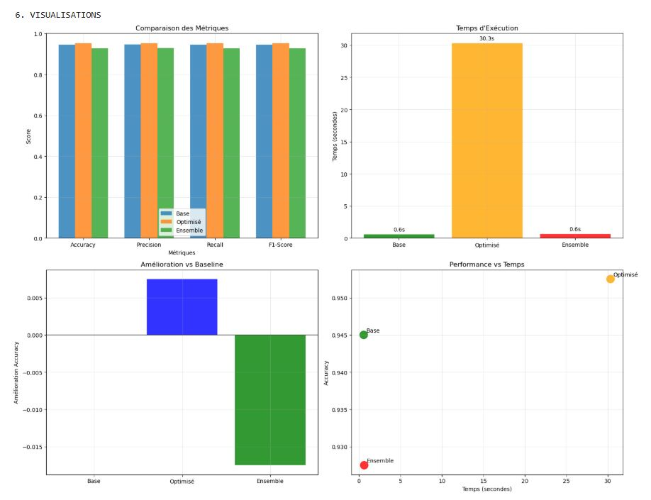

# Lecture détaillée des graphiques — Hyperparameter Tuning & Ensembles

> Document avec l’image incluse ci‑dessous (intégrée en base64 pour que le `.md` sea portable).

## Image

---

## 1) Comparaison des Métriques (en haut à gauche)

**Légende couleurs (dans ce graphe)** :  
- **Bleu = Base** (pipeline par défaut)  
- **Orange = Optimisé** (après tuning)  
- **Vert = Ensemble** (vote/stacking simple)  

**Lecture** : quatre groupes de barres (Accuracy, Precision, Recall, F1‑Score).  
Dans chaque groupe : **Orange > Bleu > Vert**. Les valeurs sont toutes élevées (~0.93–0.96), mais :  
- **Orange (Optimisé)** est **légèrement au‑dessus** (≈ +0.5 à +0.7 point selon la métrique).  
- **Bleu (Base)** est **proche** d’Orange — déjà un bon niveau sans tuning.  
- **Vert (Ensemble)** est **en dessous** (~0.92–0.93), ce qui signifie que l’ensemble testé **n’améliore pas** la performance ici.

---

## 2) Temps d’Exécution (en haut à droite)

**Couleurs (dans ce graphe)** :  
- **Vert = Base**, **Orange = Optimisé**, **Rouge = Ensemble**.

**Lecture** :  
- **Orange (Optimisé)** ~ **30,3 s** → coût important dû au Grid/Random Search.  
- **Vert (Base)** ~ **0,6 s** → quasi instantané.  
- **Rouge (Ensemble)** ~ **0,6 s** → proche du Base.

---

## 3) Amélioration vs Baseline (en bas à gauche)

**Couleurs (dans ce graphe)** :  
- **Gris = Base** (référence, amélioration = 0).  
- **Bleu = Optimisé** (amélioration **positive** ≈ **+0,006**).  
- **Vert = Ensemble** (amélioration **négative** ≈ **−0,017**).

---

## 4) Performance vs Temps (en bas à droite)

**Couleurs (dans ce graphe)** :  
- **Vert = Base**, **Orange = Optimisé**, **Rouge = Ensemble**.

**Lecture** : chaque point = (Temps d’exécution, Accuracy).  
- **Orange (Optimisé)** : **meilleure accuracy**, **le plus lent** (coin haut‑droit).  
- **Vert (Base)** : **bon compromis** vitesse/performance (~0,945 en ~0,6 s).  
- **Rouge (Ensemble)** : **rapide** mais **moins précis** (~0,929).

---

## Conclusions rapides
- Le **tuning** apporte un **gain modeste mais réel** sur toutes les métriques.  
- Ce gain se paie par un **temps de calcul** beaucoup plus élevé.  
- L’**ensemble** tel quel n’apporte pas de gain : à reconfigurer (diversité, méta‑modèle, calibration, seuils).
